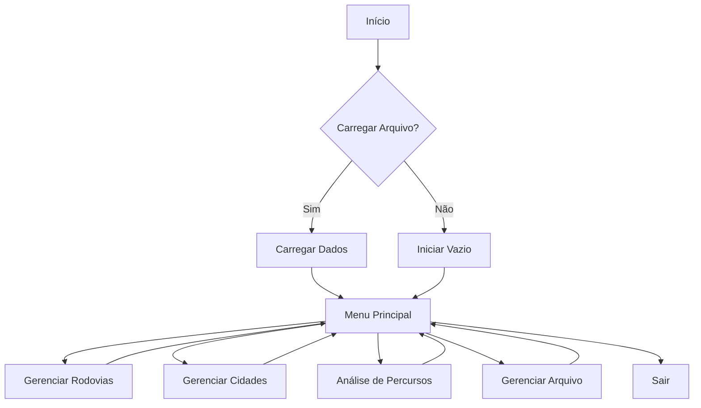
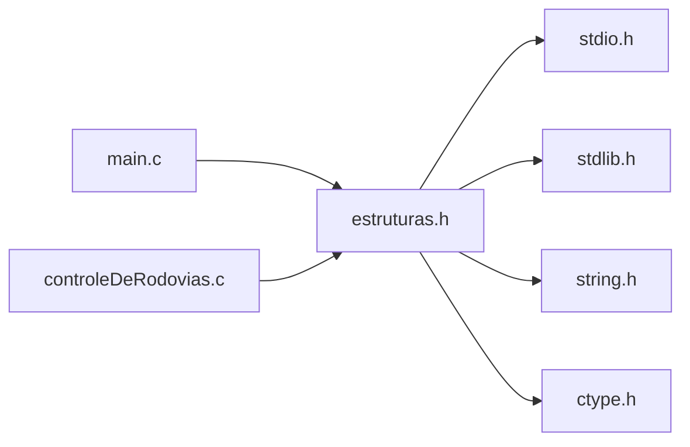
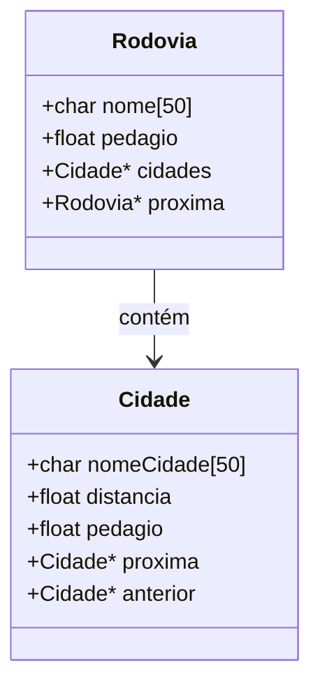

# Sistema de Gerenciamento de Rodovias
## Documentação Técnica Detalhada v1.0

## Sumário
1. [Visão Geral do Sistema](#1-visão-geral-do-sistema)
2. [Arquitetura](#2-arquitetura)
3. [Estruturas de Dados](#3-estruturas-de-dados)
4. [API de Funções](#4-api-de-funções)
5. [Algoritmos Principais](#5-algoritmos-principais)
6. [Análise de Complexidade](#6-análise-de-complexidade)
7. [Tratamento de Erros](#7-tratamento-de-erros)
8. [Persistência de Dados](#8-persistência-de-dados)
9. [Testes e Validação](#9-testes-e-validação)
10. [Limitações e Melhorias Futuras](#10-limitações-e-melhorias-futuras)

## 1. Visão Geral do Sistema

### 1.1 Propósito
O sistema foi desenvolvido para gerenciar uma rede de rodovias interligadas, permitindo o controle de cidades, distâncias e pedágios. O sistema oferece funcionalidades para análise de percursos e identificação de cruzamentos entre rodovias.

### 1.2 Funcionalidades Principais
- Gerenciamento de rodovias (inserção, remoção, busca)
- Gerenciamento de cidades (inserção ordenada, remoção)
- Cálculo de percursos e pedágios
- Identificação de cruzamentos entre rodovias
- Persistência de dados em arquivo

### 1.3 Diagrama de Fluxo do Sistema



## 2. Arquitetura

### 2.1 Organização do Código
O sistema está organizado em três arquivos principais:
- `estruturas.h`: Definições de tipos e protótipos
- `controleDeRodovias.c`: Implementação das funções
- `main.c`: Ponto de entrada e interface com usuário

### 2.2 Diagrama de Dependências



## 3. Estruturas de Dados

### 3.1 Diagrama de Estruturas



### 3.2 Detalhamento das Estruturas

#### 3.2.1 Estrutura Rodovia
```c
typedef struct Rodovia {
    char nome[50];          // Nome da rodovia
    Cidade *cidades;        // Lista de cidades
    float pedagio;          // Soma total dos pedágios
    struct Rodovia *proxima;// Próxima rodovia na lista
} Rodovia;
```

**Características:**
- Implementada como lista encadeada simples
- Nome limitado a 49 caracteres + terminador nulo
- Pedágio representa a soma dos pedágios de todas as cidades

#### 3.2.2 Estrutura Cidade
```c
typedef struct Cidade {
    char nomeCidade[50];    // Nome da cidade
    float distancia;        // Distância do início da rodovia
    float pedagio;          // Valor do pedágio
    struct Cidade *proxima; // Próxima cidade na lista
    struct Cidade *anterior;// Cidade anterior na lista
} Cidade;
```

**Características:**
- Implementada como lista duplamente encadeada
- Ordenada por distância do início da rodovia
- Suporte a navegação bidirecional

## 4. API de Funções

### 4.1 Funções de Gerenciamento de Rodovias

#### `Rodovia *inserirRodovia(Rodovia *lista, char nome[])`
**Propósito:** Inserir uma nova rodovia na lista
**Parâmetros:**
- `lista`: Ponteiro para a primeira rodovia
- `nome`: Nome da nova rodovia

**Retorno:** Ponteiro para a nova lista
**Complexidade:** O(n)

**Algoritmo:**
```c
1. Verificar se o nome já existe (case-insensitive)
2. Alocar memória para nova rodovia
3. Inicializar campos da rodovia
4. Inserir no início da lista
5. Retornar nova lista
```

[Documentação continua com detalhamento similar para todas as funções principais...]

## 5. Algoritmos Principais

### 5.1 Inserção Ordenada de Cidades

```c
Algoritmo: inserirCidade
Entrada: rodovia, nomeCidade, distancia
Saída: ponteiro para a nova cidade

1. Alocar memória para nova cidade
2. Inicializar dados da cidade
3. Se lista vazia:
   3.1 Inserir como primeira cidade
4. Senão:
   4.1 Localizar posição correta por distância
   4.2 Ajustar ponteiros anterior/próximo
   4.3 Inserir cidade na posição
5. Retornar ponteiro para nova cidade
```

### 5.2 Cálculo de Percurso

```c
Algoritmo: percursoEntreCidades
Entrada: rodovia, cidadeInicio, cidadeFim
Saída: informações do percurso

1. Localizar cidade inicial
2. Se não encontrada:
   2.1 Retornar erro
3. Enquanto não chegar ao fim:
   3.1 Calcular distância do trecho
   3.2 Somar pedágios
   3.3 Exibir informações do trecho
   3.4 Se chegou ao destino:
      3.4.1 Exibir totais
      3.4.2 Retornar
4. Se não encontrou destino:
   4.1 Exibir erro
```

## 6. Análise de Complexidade

### 6.1 Complexidade das Operações Principais

| Operação | Complexidade | Justificativa |
|----------|--------------|---------------|
| Inserir Rodovia | O(n) | Necessário verificar duplicidade |
| Remover Rodovia | O(n) | Busca linear na lista |
| Inserir Cidade | O(n) | Busca posição correta por distância |
| Remover Cidade | O(n) | Busca linear na lista de cidades |
| Buscar Rodovia | O(n) | Busca linear na lista |
| Calcular Percurso | O(n) | Percorre lista de cidades |
| Listar Cruzamentos | O(n²) | Compara todas as cidades entre duas rodovias |

### 6.2 Análise de Uso de Memória
- Cada rodovia: 50 + 8 + 4 + 8 = 70 bytes
- Cada cidade: 50 + 4 + 4 + 16 = 74 bytes
- Uso total: 70R + 74C bytes (R = nº rodovias, C = nº cidades)

## 7. Tratamento de Erros

### 7.1 Tipos de Erros Tratados
1. Falha de alocação de memória
2. Arquivo não encontrado
3. Dados duplicados
4. Dados não encontrados
5. Entrada inválida

### 7.2 Estratégias de Tratamento

```c
// Exemplo de tratamento de erro em alocação
if (novaRodovia == NULL) {
    printf("Erro de alocação de memória!\n");
    return lista;
}
```

## 8. Persistência de Dados

### 8.1 Formato do Arquivo
```
Rodovia: BR-101
Pedágio: R$ 15.50
    Cidade: São Paulo, Distância: 0.0
    Cidade: Curitiba, Distância: 408.2, Pedágio: R$ 7.50
    Cidade: Florianópolis, Distância: 693.5, Pedágio: R$ 8.00

Rodovia: BR-116
...
```

### 8.2 Funções de Persistência
- `carregarRodoviasDeArquivo`: Lê dados do arquivo
- `imprimirRodoviasEmArquivo`: Salva dados no arquivo

## 9. Testes e Validação

### 9.1 Casos de Teste Principais
1. Inserção/remoção de rodovias
2. Inserção/remoção de cidades
3. Cálculo de percursos
4. Identificação de cruzamentos
5. Persistência de dados

### 9.2 Validação de Entrada
- Verificação de nomes duplicados
- Validação de distâncias
- Verificação de valores de pedágio
- Tratamento de strings vazias

## 10. Limitações e Melhorias Futuras

### 10.1 Limitações Atuais
1. Tamanho fixo para nomes (50 caracteres)
2. Sem suporte a múltiplos pedágios entre mesmas cidades
3. Sem verificação de ciclos em rodovias
4. Busca linear em todas as operações

### 10.2 Melhorias Propostas
1. Implementar tabela hash para busca de rodovias
2. Adicionar balanceamento na estrutura
3. Suporte a múltiplos pedágios
4. Implementar verificação de ciclos
5. Adicionar suporte a coordenadas geográficas
6. Implementar algoritmos de caminho mínimo

## Apêndice A: Glossário de Termos

| Termo | Descrição |
|-------|-----------|
| Rodovia | Estrutura principal que contém lista de cidades |
| Cidade | Ponto em uma rodovia com distância e pedágio |
| Pedágio | Valor cobrado entre duas cidades |
| Cruzamento | Ponto onde duas rodovias compartilham uma cidade |

---

## Histórico de Revisões

| Versão | Data | Descrição |
|--------|------|-----------|
| 1.0 | 10/11/2024 | Versão inicial da documentação |

