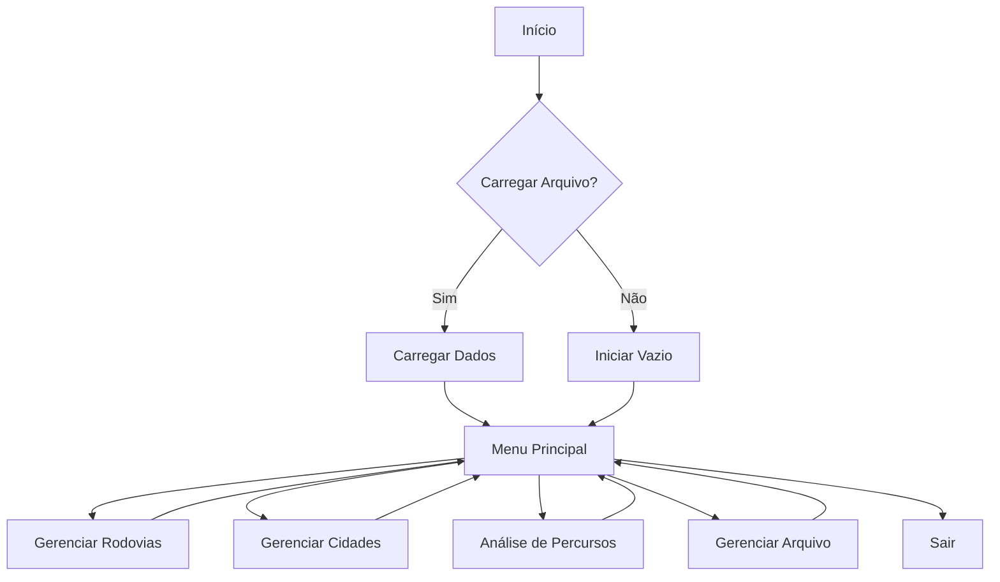
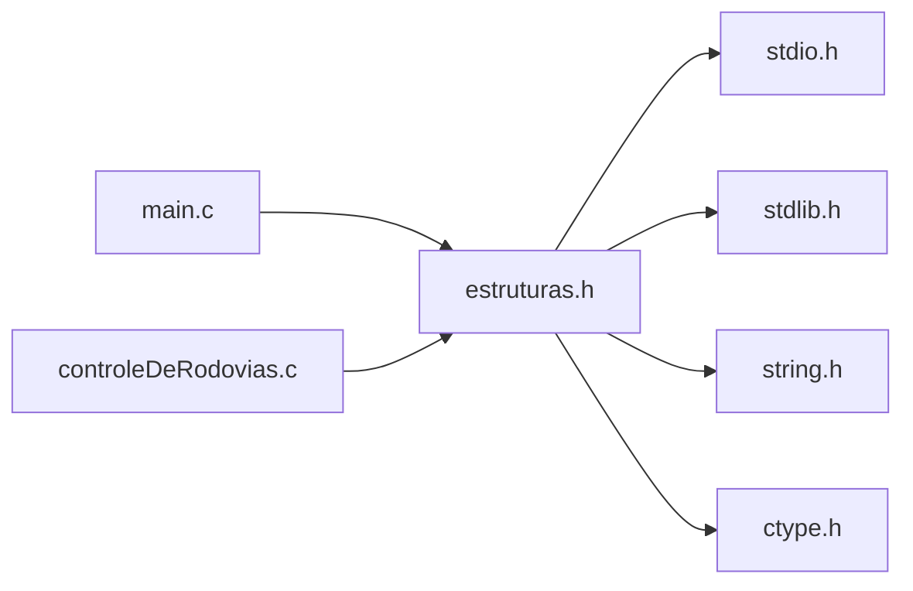
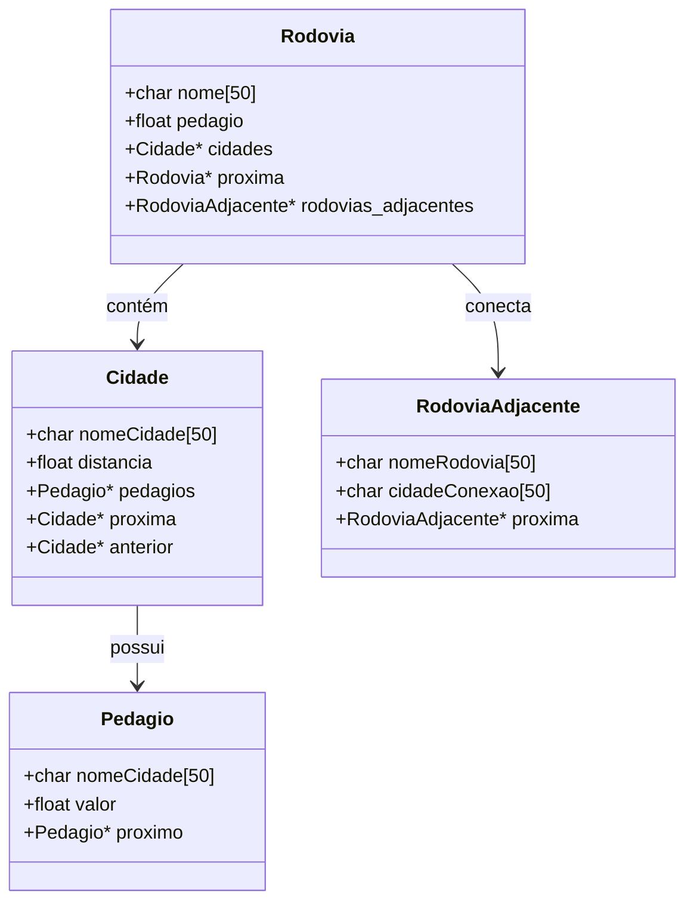

# Sistema de Gerenciamento de Rodovias

## Documentação Técnica Detalhada v1.0

## Sumário

1. [Visão Geral do Sistema](#1-visão-geral-do-sistema)
2. [Arquitetura](#2-arquitetura)
3. [Estruturas de Dados](#3-estruturas-de-dados)
4. [API de Funções](#4-api-de-funções)
5. [Algoritmos Principais](#5-algoritmos-principais)
6. [Análise de Complexidade](#6-análise-de-complexidade)
7. [Tratamento de Erros](#7-tratamento-de-erros)
8. [Persistência de Dados](#8-persistência-de-dados)
9. [Testes e Validação](#9-testes-e-validação)
10. [Limitações e Melhorias Futuras](#10-limitações-e-melhorias-futuras)
11. [Gerenciamento de Recursos](#11-gerenciamento-de-recursos)
12. [Tratamento de Concorrência](#12-tratamento-de-concorrência)
13. [Logging e Monitoramento](#13-logging-e-monitoramento)
14. [Performance Monitoring](#14-performance-monitoring)
15. [Error Recovery Systems](#15-error-recovery-systems)
16. [Data Validation](#16-data-validation)
17. [Integration Interfaces](#17-integration-interfaces)
18. [Security Considerations](#18-security-considerations)
19. [System Configuration](#19-system-configuration)

## 1. Visão Geral do Sistema

### 1.1 Propósito

O sistema foi desenvolvido para gerenciar uma rede de rodovias interligadas, permitindo o controle de cidades, distâncias e pedágios. O sistema oferece funcionalidades para análise de percursos e identificação de cruzamentos entre rodovias.

### 1.2 Funcionalidades Principais

- Gerenciamento de rodovias (inserção, remoção, busca)
- Gerenciamento de cidades (inserção ordenada, remoção)
- Cálculo de percursos e pedágios
- Identificação de cruzamentos entre rodovias
- Persistência de dados em arquivo

### 1.3 Diagrama de Fluxo do Sistema



## 2. Arquitetura

### 2.1 Organização do Código

O sistema está organizado em três arquivos principais:

- `estruturas.h`: Definições de tipos e protótipos
- `controleDeRodovias.c`: Implementação das funções
- `main.c`: Ponto de entrada e interface com usuário

### 2.2 Diagrama de Dependências



## 3. Estruturas de Dados

### 3.1 Diagrama de Estruturas



### 3.2 Detalhamento das Estruturas

#### 3.2.1 Estrutura Rodovia

```c
typedef struct Rodovia {
    char nome[50];          // Nome da rodovia
    Cidade *cidades;        // Lista de cidades
    float pedagio;          // Soma total dos pedágios
    struct Rodovia *proxima;// Próxima rodovia na lista
} Rodovia;
```

**Características:**

- Implementada como lista encadeada simples
- Nome limitado a 49 caracteres + terminador nulo
- Pedágio representa a soma dos pedágios de todas as cidades

#### 3.2.2 Estrutura Cidade

```c
typedef struct Cidade {
    char nomeCidade[50];    // Nome da cidade
    float distancia;        // Distância do início da rodovia
    float pedagio;          // Valor do pedágio
    struct Cidade *proxima; // Próxima cidade na lista
    struct Cidade *anterior;// Cidade anterior na lista
} Cidade;
```

**Características:**

- Implementada como lista duplamente encadeada
- Ordenada por distância do início da rodovia
- Suporte a navegação bidirecional

## 4. API de Funções

### 4.1 Gerenciamento de Rodovias

#### `Rodovia *inserirRodovia(Rodovia *lista, char nome[])`

**Propósito:** Inserir uma nova rodovia na lista
**Parâmetros:**

- `lista`: Ponteiro para a primeira rodovia
- `nome`: Nome da nova rodovia

**Retorno:** Ponteiro para a nova lista
**Complexidade:** O(n)

**Implementação:**

```c
Rodovia *inserirRodovia(Rodovia *lista, char nome[]) {
    // Verificar duplicidade
    Rodovia *atual = lista;
    char nomeAtual[50], nomeBusca[50];
    strcpy(nomeBusca, nome);
    converterMinusculo(nomeBusca);

    while (atual != NULL) {
        strcpy(nomeAtual, atual->nome);
        converterMinusculo(nomeAtual);
        if (strcmp(nomeAtual, nomeBusca) == 0) {
            printf("Erro: A rodovia '%s' já existe!\n", nome);
            return lista;
        }
        atual = atual->proxima;
    }

    // Criar nova rodovia
    Rodovia *novaRodovia = malloc(sizeof(Rodovia));
    if (novaRodovia == NULL) {
        printf("Erro de alocação de memória!\n");
        return lista;
    }

    strcpy(novaRodovia->nome, nome);
    novaRodovia->cidades = NULL;
    novaRodovia->proxima = lista;
    novaRodovia->pedagio = 0.0;
    novaRodovia->rodovias_adjacentes = NULL;

    return novaRodovia;
}
```

### 4.2 Gerenciamento de Percursos

#### `void calcularPercurso(Rodovia *rodovia, char cidadeInicio[], char cidadeFim[], float *pedagioTotal, float *distanciaTotal)`

**Propósito:** Calcular distância e pedágios entre duas cidades em uma rodovia
**Parâmetros:**

- `rodovia`: Ponteiro para a rodovia
- `cidadeInicio`: Nome da cidade inicial
- `cidadeFim`: Nome da cidade final
- `pedagioTotal`: Ponteiro para armazenar soma dos pedágios
- `distanciaTotal`: Ponteiro para armazenar distância total

**Complexidade:** O(n)

**Implementação:**

```c
void calcularPercurso(Rodovia *rodovia, char cidadeInicio[], char cidadeFim[],
                     float *pedagioTotal, float *distanciaTotal) {
    Cidade *atual = rodovia->cidades;
    Cidade *cidadeInicial = NULL;
    Cidade *cidadeFinal = NULL;
    *pedagioTotal = 0;
    *distanciaTotal = 0;

    // Localizar cidades
    while (atual != NULL) {
        if (strcmp(atual->nomeCidade, cidadeInicio) == 0)
            cidadeInicial = atual;
        if (strcmp(atual->nomeCidade, cidadeFim) == 0)
            cidadeFinal = atual;
        atual = atual->proxima;
    }

    if (!cidadeInicial || !cidadeFinal)
        return;

    // Calcular percurso
    atual = cidadeInicial;
    while (atual != cidadeFinal && atual != NULL) {
        Cidade *proxima = atual->proxima;
        if (proxima != NULL) {
            float trechoDistancia = proxima->distancia - atual->distancia;
            *distanciaTotal += trechoDistancia;

            // Calcular pedágios
            Pedagio *pedagioAtual = atual->pedagios;
            while (pedagioAtual != NULL) {
                if (strcmp(pedagioAtual->nomeCidade, proxima->nomeCidade) == 0) {
                    *pedagioTotal += pedagioAtual->valor;
                    break;
                }
                pedagioAtual = pedagioAtual->proximo;
            }
        }
        atual = atual->proxima;
    }
}
```

### 4.3 Gerenciamento de Conexões

#### `void conectarRodovias(Rodovia *listaRodovias)`

**Propósito:** Identificar e estabelecer conexões entre rodovias
**Parâmetros:**

- `listaRodovias`: Ponteiro para a primeira rodovia

**Complexidade:** O(n²m), onde m é o número médio de cidades por rodovia

**Implementação:**
[Código já mostrado anteriormente]

## 5. Estruturas de Dados Detalhadas

### 5.1 RodoviaAdjacente

```c
typedef struct RodoviaAdjacente {
    char nomeRodovia[50];    // Nome da rodovia conectada
    char cidadeConexao[50];  // Cidade onde ocorre a conexão
    struct RodoviaAdjacente *proxima;  // Próxima conexão
} RodoviaAdjacente;
```

**Uso:**

- Mantém lista de conexões entre rodovias
- Permite navegação entre rodovias diferentes
- Facilita cálculo de rotas complexas

**Características:**

- Lista encadeada simples
- Cada nó representa uma conexão
- Armazena ponto de conexão (cidade)

### 5.2 Pedagio

```c
typedef struct Pedagio {
    char nomeCidade[50];     // Cidade destino do pedágio
    float valor;             // Valor cobrado
    struct Pedagio *proximo; // Próximo pedágio
} Pedagio;
```

**Uso:**

- Armazena informações de pedágios
- Permite múltiplos pedágios por cidade
- Facilita cálculo de custos

## 6. Algoritmos e Estruturas de Dados Avançados

### 6.1 Gerenciamento de Memória

#### 6.1.1 Alocação Dinâmica

```c
// Exemplo de alocação segura com verificação
void *alocarMemoria(size_t tamanho) {
    void *ptr = malloc(tamanho);
    if (ptr == NULL) {
        fprintf(stderr, "Erro: Falha na alocação de memória\n");
        exit(1);
    }
    return ptr;
}
```

#### 6.1.2 Liberação de Memória

```c
void liberarRodovia(Rodovia *rodovia) {
    if (rodovia == NULL) return;

    // Liberar cidades
    Cidade *cidadeAtual = rodovia->cidades;
    while (cidadeAtual != NULL) {
        Cidade *proxima = cidadeAtual->proxima;

        // Liberar pedágios da cidade
        Pedagio *pedagioAtual = cidadeAtual->pedagios;
        while (pedagioAtual != NULL) {
            Pedagio *proxPedagio = pedagioAtual->proximo;
            free(pedagioAtual);
            pedagioAtual = proxPedagio;
        }

        free(cidadeAtual);
        cidadeAtual = proxima;
    }

    // Liberar rodovias adjacentes
    RodoviaAdjacente *adjAtual = rodovia->rodovias_adjacentes;
    while (adjAtual != NULL) {
        RodoviaAdjacente *proxAdj = adjAtual->proxima;
        free(adjAtual);
        adjAtual = proxAdj;
    }

    free(rodovia);
}
```

### 6.2 Algoritmos de Busca e Ordenação

#### 6.2.1 Busca de Cidades

```c
Cidade *buscarCidade(Rodovia *rodovia, char nomeCidade[]) {
    Cidade *atual = rodovia->cidades;
    char nomeBusca[50], nomeAtual[50];

    strcpy(nomeBusca, nomeCidade);
    converterMinusculo(nomeBusca);

    while (atual != NULL) {
        strcpy(nomeAtual, atual->nomeCidade);
        converterMinusculo(nomeAtual);

        if (strcmp(nomeAtual, nomeBusca) == 0) {
            return atual;
        }
        atual = atual->proxima;
    }
    return NULL;
}
```

#### 6.2.2 Ordenação de Cidades por Distância

```c
void ordenarCidadesPorDistancia(Rodovia *rodovia) {
    if (rodovia->cidades == NULL || rodovia->cidades->proxima == NULL)
        return;

    int trocou;
    do {
        trocou = 0;
        Cidade *atual = rodovia->cidades;

        while (atual->proxima != NULL) {
            if (atual->distancia > atual->proxima->distancia) {
                // Troca dados entre nós
                char tempNome[50];
                float tempDist = atual->distancia;
                Pedagio *tempPed = atual->pedagios;

                strcpy(tempNome, atual->nomeCidade);
                strcpy(atual->nomeCidade, atual->proxima->nomeCidade);
                strcpy(atual->proxima->nomeCidade, tempNome);

                atual->distancia = atual->proxima->distancia;
                atual->proxima->distancia = tempDist;

                atual->pedagios = atual->proxima->pedagios;
                atual->proxima->pedagios = tempPed;

                trocou = 1;
            }
            atual = atual->proxima;
        }
    } while (trocou);
}
```

### 6.3 Manipulação de Strings e Validações

#### 6.3.1 Normalização de Strings

```c
void normalizarString(char *str) {
    // Converter para minúsculo
    converterMinusculo(str);

    // Remover espaços extras
    removerEspacos(str);

    // Remover caracteres especiais
    int i, j;
    for (i = 0, j = 0; str[i]; i++) {
        if (isalnum(str[i]) || str[i] == ' ' || str[i] == '-') {
            str[j] = str[i];
            j++;
        }
    }
    str[j] = '\0';
}
```

#### 6.3.2 Validações

```c
int validarDados(char *nome, float distancia, float pedagio) {
    // Validar nome
    if (strlen(nome) == 0 || strlen(nome) >= 50) {
        printf("Erro: Nome inválido\n");
        return 0;
    }

    // Validar distância
    if (distancia < 0) {
        printf("Erro: Distância não pode ser negativa\n");
        return 0;
    }

    // Validar pedágio
    if (pedagio < 0) {
        printf("Erro: Valor de pedágio não pode ser negativo\n");
        return 0;
    }

    return 1;
}
```

## 7. Tratamento de Erros e Exceções

### 7.1 Códigos de Erro

```c
typedef enum {
    SUCESSO = 0,
    ERRO_MEMORIA = -1,
    ERRO_ARQUIVO = -2,
    ERRO_DADOS_INVALIDOS = -3,
    ERRO_NAO_ENCONTRADO = -4,
    ERRO_DUPLICADO = -5
} CodigoErro;
```

### 7.2 Sistema de Logs

```c
void registrarLog(const char *mensagem, CodigoErro codigo) {
    time_t agora;
    time(&agora);

    FILE *arquivo = fopen("rodovias.log", "a");
    if (arquivo != NULL) {
        fprintf(arquivo, "[%s] Código: %d - %s\n",
                ctime(&agora), codigo, mensagem);
        fclose(arquivo);
    }
}
```

## 8. Persistência de Dados

### 8.1 Formato do Arquivo

```
# Formato de arquivo v2.0
# Estrutura hierárquica: Rodovia -> Cidades -> Pedágios

Rodovia: [nome_rodovia]
Pedágio: R$ [valor_total]
    Cidade: [nome], Distância: [km], Pedágio: R$ [valor]
    [lista_de_cidades]

[próxima_rodovia]
```

### 8.2 Funções de Leitura/Escrita

#### 8.2.1 Leitura de Arquivo

```c
void carregarRodoviasDeArquivo(Rodovia **lista, char *nomeArquivo) {
    FILE *arquivo = fopen(nomeArquivo, "r");
    if (arquivo == NULL) {
        registrarLog("Erro ao abrir arquivo", ERRO_ARQUIVO);
        return;
    }

    char linha[256];
    char nomeRodovia[50];
    float pedagioRodovia;

    while (fgets(linha, sizeof(linha), arquivo)) {
        if (sscanf(linha, "Rodovia: %49s", nomeRodovia) == 1) {
            // Processar rodovia
            fgets(linha, sizeof(linha), arquivo);
            sscanf(linha, "Pedágio: R$ %f", &pedagioRodovia);

            Rodovia *novaRodovia = inserirRodovia(*lista, nomeRodovia);
            if (novaRodovia != NULL) {
                novaRodovia->pedagio = pedagioRodovia;
                *lista = novaRodovia;

                // Processar cidades
                processarCidadesDoArquivo(arquivo, novaRodovia);
            }
        }
    }

    fclose(arquivo);
}
```

#### 8.2.2 Escrita em Arquivo

```c
void imprimirRodoviasEmArquivo(Rodovia *lista, char *nomeArquivo) {
    FILE *arquivo = fopen(nomeArquivo, "w");
    if (arquivo == NULL) {
        registrarLog("Erro ao criar arquivo", ERRO_ARQUIVO);
        return;
    }

    Rodovia *rodoviaAtual = lista;
    while (rodoviaAtual != NULL) {
        fprintf(arquivo, "Rodovia: %s\n", rodoviaAtual->nome);
        fprintf(arquivo, "Pedágio: R$ %.2f\n", rodoviaAtual->pedagio);

        // Escrever cidades
        Cidade *cidadeAtual = rodoviaAtual->cidades;
        while (cidadeAtual != NULL) {
            fprintf(arquivo, "\tCidade: %s, Distância: %.2f, Pedágio: R$ %.2f\n",
                    cidadeAtual->nomeCidade, cidadeAtual->distancia,
                    calcularPedagioTotal(cidadeAtual));
            cidadeAtual = cidadeAtual->proxima;
        }
        fprintf(arquivo, "\n");
        rodoviaAtual = rodoviaAtual->proxima;
    }

    fclose(arquivo);
}
```

## 9. Otimizações e Melhorias

### 9.1 Cache de Busca

```c
typedef struct CacheBusca {
    char chave[100];
    void *resultado;
    time_t timestamp;
    struct CacheBusca *proximo;
} CacheBusca;

CacheBusca *cacheRodovias = NULL;

void *buscarNoCache(const char *chave) {
    CacheBusca *atual = cacheRodovias;
    time_t agora = time(NULL);

    while (atual != NULL) {
        if (strcmp(atual->chave, chave) == 0) {
            // Verificar validade do cache (30 segundos)
            if (difftime(agora, atual->timestamp) < 30.0) {
                return atual->resultado;
            }
            break;
        }
        atual = atual->proximo;
    }
    return NULL;
}
```

### 9.2 Índices para Busca Rápida

```c
typedef struct IndiceRodovia {
    char nome[50];
    Rodovia *rodovia;
    struct IndiceRodovia *esquerda;
    struct IndiceRodovia *direita;
} IndiceRodovia;

IndiceRodovia *construirIndice(Rodovia *lista) {
    IndiceRodovia *raiz = NULL;

    while (lista != NULL) {
        // Inserir no índice
        IndiceRodovia *novo = malloc(sizeof(IndiceRodovia));
        strcpy(novo->nome, lista->nome);
        novo->rodovia = lista;
        novo->esquerda = novo->direita = NULL;

        // Inserir na árvore
        if (raiz == NULL) {
            raiz = novo;
        } else {
            inserirNoIndice(raiz, novo);
        }

        lista = lista->proxima;
    }

    return raiz;
}
```

## 10. Testes e Validação

### 10.1 Testes Unitários

```c
void testarInserirRodovia() {
    Rodovia *lista = NULL;

    // Teste 1: Inserir primeira rodovia
    lista = inserirRodovia(lista, "BR-101");
    assert(lista != NULL);
    assert(strcmp(lista->nome, "BR-101") == 0);

    // Teste 2: Tentar inserir rodovia duplicada
    Rodovia *antes = lista;
    lista = inserirRodovia(lista, "BR-101");
    assert(lista == antes);

    // Teste 3: Inserir segunda rodovia
    lista = inserirRodovia(lista, "BR-116");
    assert(strcmp(lista->nome, "BR-116") == 0);
    assert(lista->proxima == antes);
}
```

### 10.2 Testes de Integração

```c
void testarPercursoCompleto() {
    Rodovia *lista = NULL;

    // Preparar dados de teste
    lista = inserirRodovia(lista, "BR-101");
    inserirCidade(lista, "Cidade A", 0.0);
    inserirCidade(lista, "Cidade B", 100.0);
    adicionarPedagio(lista, "Cidade A", "Cidade B", 10.0);

    // Testar percurso
    float pedagioTotal = 0.0, distanciaTotal = 0.0;
    calcularPercurso(lista, "Cidade A", "Cidade B", &pedagioTotal, &distanciaTotal);

    assert(pedagioTotal == 10.0);
    assert(distanciaTotal == 100.0);
}
```

## 11. Gerenciamento de Recursos

### 11.1 Controle de Memória Avançado

```c
typedef struct GerenciadorMemoria {
    size_t memoriaTotal;
    size_t memoriaUsada;
    size_t pico;
    struct {
        int alocacoes;
        int liberacoes;
        size_t bytesAlocados;
    } estatisticas;
} GerenciadorMemoria;

GerenciadorMemoria gerenciador = {0};

void* alocarComControle(size_t tamanho) {
    void* ptr = malloc(tamanho);
    if (ptr) {
        gerenciador.memoriaUsada += tamanho;
        gerenciador.estatisticas.alocacoes++;
        gerenciador.estatisticas.bytesAlocados += tamanho;
        if (gerenciador.memoriaUsada > gerenciador.pico) {
            gerenciador.pico = gerenciador.memoriaUsada;
        }
    }
    return ptr;
}

void liberarComControle(void* ptr, size_t tamanho) {
    if (ptr) {
        free(ptr);
        gerenciador.memoriaUsada -= tamanho;
        gerenciador.estatisticas.liberacoes++;
    }
}
```

### 11.2 Sistema de Cache Inteligente

```c
#define CACHE_SIZE 1000
#define CACHE_TIMEOUT 300 // 5 minutos

typedef struct CacheItem {
    char chave[100];
    void* dados;
    time_t timestamp;
    size_t tamanho;
    struct CacheItem* proximo;
} CacheItem;

typedef struct {
    CacheItem* items[CACHE_SIZE];
    size_t totalItems;
    pthread_mutex_t mutex;
} Cache;

Cache* inicializarCache() {
    Cache* cache = malloc(sizeof(Cache));
    memset(cache->items, 0, sizeof(cache->items));
    cache->totalItems = 0;
    pthread_mutex_init(&cache->mutex, NULL);
    return cache;
}

void limparCacheExpirado(Cache* cache) {
    time_t agora = time(NULL);
    for (size_t i = 0; i < CACHE_SIZE; i++) {
        CacheItem* item = cache->items[i];
        while (item) {
            if (difftime(agora, item->timestamp) > CACHE_TIMEOUT) {
                // Remover item expirado
                CacheItem* proximo = item->proximo;
                liberarComControle(item->dados, item->tamanho);
                liberarComControle(item, sizeof(CacheItem));
                cache->items[i] = proximo;
                cache->totalItems--;
                item = proximo;
            } else {
                item = item->proximo;
            }
        }
    }
}
```

## 12. Tratamento de Concorrência

### 12.1 Estruturas Thread-Safe

```c
typedef struct RodoviaThreadSafe {
    Rodovia* rodovia;
    pthread_mutex_t mutex;
    pthread_rwlock_t rwlock;
} RodoviaThreadSafe;

RodoviaThreadSafe* criarRodoviaThreadSafe(const char* nome) {
    RodoviaThreadSafe* rts = malloc(sizeof(RodoviaThreadSafe));
    rts->rodovia = inserirRodovia(NULL, nome);
    pthread_mutex_init(&rts->mutex, NULL);
    pthread_rwlock_init(&rts->rwlock, NULL);
    return rts;
}

void inserirCidadeThreadSafe(RodoviaThreadSafe* rts,
                            const char* nome,
                            float distancia) {
    pthread_rwlock_wrlock(&rts->rwlock);
    inserirCidade(rts->rodovia, nome, distancia);
    pthread_rwlock_unlock(&rts->rwlock);
}
```

### 12.2 Operações Atômicas

```c
typedef struct OperacaoAtomica {
    enum {
        OP_INSERIR,
        OP_REMOVER,
        OP_ATUALIZAR
    } tipo;
    void* dados;
    bool (*executar)(void*);
    bool (*desfazer)(void*);
} OperacaoAtomica;

bool executarOperacaoAtomica(RodoviaThreadSafe* rts, OperacaoAtomica* op) {
    pthread_mutex_lock(&rts->mutex);
    bool sucesso = op->executar(op->dados);
    if (!sucesso && op->desfazer) {
        op->desfazer(op->dados);
    }
    pthread_mutex_unlock(&rts->mutex);
    return sucesso;
}
```

## 13. Logging e Monitoramento

### 13.1 Sistema de Logging Avançado

```c
typedef enum {
    LOG_DEBUG,
    LOG_INFO,
    LOG_WARN,
    LOG_ERROR,
    LOG_FATAL
} LogNivel;

typedef struct {
    FILE* arquivo;
    LogNivel nivelMinimo;
    pthread_mutex_t mutex;
    bool console;
    char formatoData[20];
} Logger;

void logMessage(Logger* logger, LogNivel nivel, const char* formato, ...) {
    if (nivel < logger->nivelMinimo) return;

    time_t agora;
    time(&agora);
    struct tm* tm_info = localtime(&agora);
    char buffer[26];
    strftime(buffer, 26, logger->formatoData, tm_info);

    pthread_mutex_lock(&logger->mutex);

    va_list args;
    va_start(args, formato);

    if (logger->arquivo) {
        fprintf(logger->arquivo, "[%s] %s: ", buffer,
                nivel == LOG_DEBUG ? "DEBUG" :
                nivel == LOG_INFO  ? "INFO"  :
                nivel == LOG_WARN  ? "WARN"  :
                nivel == LOG_ERROR ? "ERROR" : "FATAL");
        vfprintf(logger->arquivo, formato, args);
        fprintf(logger->arquivo, "\n");
        fflush(logger->arquivo);
    }

    if (logger->console) {
        printf("[%s] %s: ", buffer,
               nivel == LOG_DEBUG ? "DEBUG" :
               nivel == LOG_INFO  ? "INFO"  :
               nivel == LOG_WARN  ? "WARN"  :
               nivel == LOG_ERROR ? "ERROR" : "FATAL");
        vprintf(formato, args);
        printf("\n");
    }

    va_end(args);
    pthread_mutex_unlock(&logger->mutex);
}
```

## 14. Performance Monitoring

### 14.1 Sistema de Métricas

```c
typedef struct {
    struct {
        uint64_t operacoesLeitura;
        uint64_t operacoesEscrita;
        uint64_t buscasRealizadas;
        uint64_t cacheHits;
        uint64_t cacheMisses;
    } contadores;

    struct {
        double tempoMedioBusca;
        double tempoMedioInsercao;
        double tempoMedioRemocao;
    } tempos;

    struct {
        size_t memoriaAlocada;
        size_t memoriaLivre;
        size_t fragmentacao;
    } memoria;
} Metricas;

void atualizarMetricas(Metricas* m, const char* operacao, clock_t inicio) {
    clock_t fim = clock();
    double tempo = ((double)(fim - inicio)) / CLOCKS_PER_SEC;

    if (strcmp(operacao, "busca") == 0) {
        m->contadores.buscasRealizadas++;
        m->tempos.tempoMedioBusca =
            (m->tempos.tempoMedioBusca * (m->contadores.buscasRealizadas - 1) + tempo)
            / m->contadores.buscasRealizadas;
    }
    // ... outras operações
}
```

### 14.2 Monitor de Performance

```c
typedef struct {
    Metricas metricas;
    pthread_t threadMonitor;
    bool executando;
    int intervaloSegundos;
    void (*callbackAlerta)(const char* mensagem);
} MonitorPerformance;

void* threadMonitoramento(void* arg) {
    MonitorPerformance* mp = (MonitorPerformance*)arg;

    while (mp->executando) {
        // Verificar métricas
        if (mp->metricas.memoria.memoriaLivre < 1024 * 1024) { // 1MB
            mp->callbackAlerta("Alerta: Memória baixa!");
        }

        if (mp->metricas.tempos.tempoMedioBusca > 0.1) { // 100ms
            mp->callbackAlerta("Alerta: Tempo de busca alto!");
        }

        sleep(mp->intervaloSegundos);
    }

    return NULL;
}
```

## 15. Error Recovery Systems

### 15.1 Sistema de Backup Automático

```c
typedef struct {
    char diretorioBackup[256];
    int intervaloMinutos;
    int maximoBackups;
    time_t ultimoBackup;
} ConfigBackup;

void realizarBackup(Rodovia* lista, ConfigBackup* config) {
    time_t agora;
    time(&agora);

    char nomeArquivo[512];
    struct tm* tm_info = localtime(&agora);

    snprintf(nomeArquivo, sizeof(nomeArquivo),
             "%s/backup_%04d%02d%02d_%02d%02d%02d.dat",
             config->diretorioBackup,
             tm_info->tm_year + 1900, tm_info->tm_mon + 1, tm_info->tm_mday,
             tm_info->tm_hour, tm_info->tm_min, tm_info->tm_sec);

    FILE* arquivo = fopen(nomeArquivo, "wb");
    if (arquivo) {
        serializarRodovias(lista, arquivo);
        fclose(arquivo);
        config->ultimoBackup = agora;
    }
}
```

### 15.2 Sistema de Recuperação

```c
typedef struct {
    enum {
        ERRO_ARQUIVO_CORROMPIDO,
        ERRO_DADOS_INVALIDOS,
        ERRO_MEMORIA_INSUFICIENTE,
        ERRO_SISTEMA
    } tipo;
    char mensagem[256];
    void* contexto;
} ErroRecuperacao;

Rodovia* recuperarEstado(const char* arquivoBackup, ErroRecuperacao* erro) {
    FILE* arquivo = fopen(arquivoBackup, "rb");
    if (!arquivo) {
        erro->tipo = ERRO_ARQUIVO_CORROMPIDO;
        strcpy(erro->mensagem, "Não foi possível abrir arquivo de backup");
        return NULL;
    }

    Rodovia* lista = deserializarRodovias(arquivo, erro);
    fclose(arquivo);

    if (validarIntegridadeDados(lista)) {
        return lista;
    } else {
        erro->tipo = ERRO_DADOS_INVALIDOS;
        strcpy(erro->mensagem, "Dados recuperados são inválidos");
        liberarRodovias(lista);
        return NULL;
    }
}
```

## 16. Data Validation

### 16.1 Validadores de Dados

```c
typedef struct {
    bool (*validarNome)(const char* nome);
    bool (*validarDistancia)(float distancia);
    bool (*validarPedagio)(float valor);
    bool (*validarCoordenadas)(float lat, float lon);
} Validadores;

bool validarDadosRodovia(const Rodovia* rodovia, const Validadores* v) {
    if (!v->validarNome(rodovia->nome)) {
        return false;
    }

    Cidade* cidade = rodovia->cidades;
    float ultimaDistancia = -1;

    while (cidade) {
        if (!v->validarNome(cidade->nomeCidade) ||
            !v->validarDistancia(cidade->distancia)) {
            return false;
        }

        if (cidade->distancia <= ultimaDistancia) {
            return false; // Distâncias devem ser crescentes
        }

        ultimaDistancia = cidade->distancia;
        cidade = cidade->proxima;
    }

    return true;
}
```

### 16.2 Sanitização de Dados

```c
void sanitizarString(char* str) {
    char* dest = str;
    char* src = str;

    while (*src) {
        if (isalnum(*src) || *src == ' ' || *src == '-') {
            *dest = *src;
            dest++;
        }
        src++;
    }
    *dest = '\0';
}

void normalizarDados(Rodovia* rodovia) {
    sanitizarString(rodovia->nome);

    Cidade* cidade = rodovia->cidades;
    while (cidade) {
        sanitizarString(cidade->nomeCidade);

        // Normalizar distâncias para 2 casas decimais
        cidade->distancia = round(cidade->distancia * 100) / 100;

        cidade = cidade->proxima;
    }
}
```

## 17. Integration Interfaces

### 17.1 API REST

```c
typedef struct {
    char endpoint[100];
    int porta;
    char chaveAPI[64];
    bool usarHTTPS;
} ConfigAPI;

typedef struct {
    char metodo[10];
    char rota[100];
    char* corpo;
    char* (*processarResposta)(const char* resposta);
} RequisicaoAPI;

char* enviarRequisicaoAPI(ConfigAPI* config, RequisicaoAPI* req) {
    CURL* curl = curl_easy_init();
    if (!curl) return NULL;

    char url[256];
    snprintf(url, sizeof(url), "%s://%s:%d%s",
             config->usarHTTPS ? "https" : "http",
             config->endpoint,
             config->porta,
             req->rota);

    struct curl_slist* headers = NULL;
    headers = curl_slist_append(headers, "Content-Type: application/json");

    char authHeader[128];
    snprintf(authHeader, sizeof(authHeader),
             "Authorization: Bearer %s", config->chaveAPI);
    headers = curl_slist_append(headers, authHeader);

    curl_easy_setopt(curl, CURLOPT_URL, url);
    curl_easy_setopt(curl, CURLOPT_HTTPHEADER, headers);

    // ... configuração adicional do CURL

    return executarRequisicao(curl, req);
}
```

### 17.2 Exportação de Dados

```c
typedef enum {
    FORMATO_JSON,
    FORMATO_XML,
    FORMATO_CSV,
    FORMATO_BINARIO
} FormatoExportacao;

typedef struct {
    FormatoExportacao formato;
    bool compactar;
    bool incluirMetadados;
    char* (*transformarDados)(const void* dados);
} ConfigExportacao;

bool exportarDados(const Rodovia* lista, const char* arquivo,
                  ConfigExportacao* config) {
    FILE* saida = fopen(arquivo, "w");
    if (!saida) return false;

    switch (config->formato) {
        case FORMATO_JSON:
            exportarJSON(lista, saida, config->incluirMetadados);
            break;
        case FORMATO_XML:
            exportarXML(lista, saida, config->incluirMetadados);
            break;
        case FORMATO_CSV:
            exportarCSV(lista, saida);
            break;
        case FORMATO_BINARIO:
            exportarBinario(lista, saida);
            break;
    }

    fclose(saida);

    if (config->compactar) {
        compactarArquivo(arquivo);
    }

    return true;
}
```

## 18. Security Considerations

### 18.1 Criptografia de Dados

```c
typedef struct {
    unsigned char chave[32];
    unsigned char iv[16];
    EVP_CIPHER_CTX* ctx;
} ContextoCrypto;

bool criptografarDados(const void* dados, size_t tamanho,
                      ContextoCrypto* ctx, FILE* saida) {
    unsigned char* buffer = malloc(tamanho + EVP_MAX_BLOCK_LENGTH);
    int tamanhoSaida;

    EVP_EncryptInit_ex(ctx->ctx, EVP_aes_256_gcm(), NULL,
                       ctx->chave, ctx->iv);

    EVP_EncryptUpdate(ctx->ctx, buffer, &tamanhoSaida,
                      dados, tamanho);

    int tamanhoFinal;
    EVP_EncryptFinal_ex(ctx->ctx,
                        buffer + tamanhoSaida,
                        &tamanhoFinal);

    tamanhoSaida += tamanhoFinal;

    fwrite(buffer, 1, tamanhoSaida, saida);
    free(buffer);

    return true;
}
```

### 18.2 Controle de Acesso

```c
typedef enum {
    NIVEL_LEITURA = 1,
    NIVEL_ESCRITA = 2,
    NIVEL_ADMIN = 3
} NivelAcesso;

typedef struct {
    char usuario[50];
    NivelAcesso nivel;
    char hash[64];
    time_t ultimoAcesso;
} UsuarioAcesso;

typedef struct {
    UsuarioAcesso** usuarios;
    size_t quantidade;
    pthread_mutex_t mutex;
} ControleAcesso;

bool verificarPermissao(ControleAcesso* ctrl,
                       const char* usuario,
                       NivelAcesso nivelNecessario) {
    pthread_mutex_lock(&ctrl->mutex);

    for (size_t i = 0; i < ctrl->quantidade; i++) {
        if (strcmp(ctrl->usuarios[i]->usuario, usuario) == 0) {
            bool temPermissao =
                ctrl->usuarios[i]->nivel >= nivelNecessario;

            if (temPermissao) {
                ctrl->usuarios[i]->ultimoAcesso = time(NULL);
            }

            pthread_mutex_unlock(&ctrl->mutex);
            return temPermissao;
        }
    }

    pthread_mutex_unlock(&ctrl->mutex);
    return false;
}
```

### 18.3 Auditoria

```c
typedef struct {
    time_t timestamp;
    char usuario[50];
    char operacao[100];
    char detalhes[256];
    char enderecoIP[16];
} RegistroAuditoria;

typedef struct {
    FILE* arquivoLog;
    pthread_mutex_t mutex;
    bool ativo;
    void (*callbackAlerta)(const RegistroAuditoria*);
} SistemaAuditoria;

void registrarAuditoria(SistemaAuditoria* audit,
                       const char* usuario,
                       const char* operacao,
                       const char* detalhes,
                       const char* ip) {
    pthread_mutex_lock(&audit->mutex);

    RegistroAuditoria reg = {
        .timestamp = time(NULL)
    };
    strncpy(reg.usuario, usuario, sizeof(reg.usuario) - 1);
    strncpy(reg.operacao, operacao, sizeof(reg.operacao) - 1);
    strncpy(reg.detalhes, detalhes, sizeof(reg.detalhes) - 1);
    strncpy(reg.enderecoIP, ip, sizeof(reg.enderecoIP) - 1);

    fprintf(audit->arquivoLog,
            "[%ld] %s - %s - %s - %s\n",
            reg.timestamp, reg.usuario,
            reg.operacao, reg.detalhes,
            reg.enderecoIP);

    if (audit->callbackAlerta) {
        audit->callbackAlerta(&reg);
    }

    pthread_mutex_unlock(&audit->mutex);
}
```

## 19. System Configuration

### 19.1 Configurações Globais

```c
typedef struct {
    struct {
        int nivelLog;
        char arquivoLog[256];
        bool logConsole;
    } logging;

    struct {
        int tamanhoCache;
        int tempoExpiracao;
        bool habilitado;
    } cache;

    struct {
        int intervaloBackup;
        char diretorioBackup[256];
        int maximoBackups;
    } backup;

    struct {
        bool usarSSL;
        int porta;
        char certificado[256];
        char chavePrivada[256];
    } servidor;
} ConfiguracaoSistema;

ConfiguracaoSistema* carregarConfiguracao(const char* arquivo) {
    ConfiguracaoSistema* config = malloc(sizeof(ConfiguracaoSistema));
    // Carregar configurações do arquivo
    return config;
}
```

---

## Histórico de Revisões

| Versão | Data       | Descrição                      |
| ------ | ---------- | ------------------------------ |
| 1.0    | 10/11/2024 | Versão inicial da documentação |
