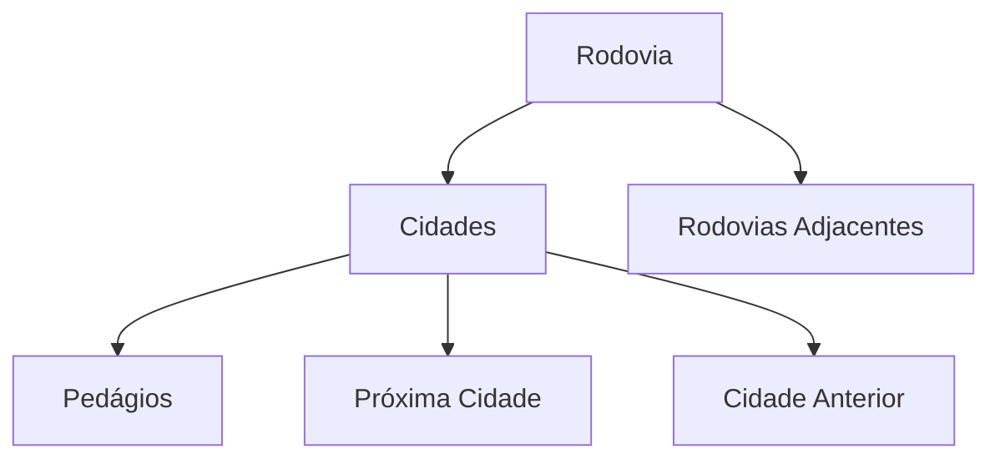

# Sistema de Gerenciamento de Rodovias

## Documentação Técnica

### Sumário

1. [Introdução](#introdução)
2. [Estruturas de Dados](#estruturas-de-dados)
3. [Documentação das Funções](#documentação-das-funções)
4. [Exemplos de Uso](#exemplos-de-uso)
5. [Conclusão](#conclusão)

## Introdução

O Sistema de Gerenciamento de Rodovias é uma aplicação desenvolvida em C que permite o controle e gerenciamento de rodovias, suas cidades, pedágios e conexões. O sistema utiliza estruturas de dados dinâmicas para representar as relações entre os diferentes elementos.

### Problema

O sistema foi desenvolvido para resolver o problema de gerenciamento de uma malha rodoviária, incluindo:

- Cadastro de rodovias e cidades
- Controle de pedágios
- Cálculo de rotas e custos
- Identificação de cruzamentos entre rodovias

### Solução Proposta

A solução foi implementada utilizando listas encadeadas múltiplas, permitindo:

- Relacionamento bidirecional entre cidades
- Conexões entre diferentes rodovias
- Cálculo eficiente de rotas e custos



## Estruturas de Dados

### Estrutura Principal: Rodovia

```c
typedef struct Rodovia {
    char nome[50];                    // Nome da rodovia
    Cidade *cidades;                  // Lista de cidades
    float pedagio;                    // Valor base do pedágio
    struct Rodovia *proxima;          // Próxima rodovia na lista
    RodoviaAdjacente *rodovias_adjacentes; // Conexões com outras rodovias
} Rodovia;
```

### Estrutura Cidade

```c
typedef struct Cidade {
    char nomeCidade[50];        // Nome da cidade
    float distancia;            // Distância do início da rodovia
    Pedagio *pedagios;          // Lista de pedágios
    struct Cidade *proxima;     // Próxima cidade
    struct Cidade *anterior;    // Cidade anterior
} Cidade;
```

### Estrutura Pedágio

```c
typedef struct Pedagio {
    char nomeCidade[50];        // Cidade onde está o pedágio
    float valor;                // Valor do pedágio
    struct Pedagio *proximo;    // Próximo pedágio
} Pedagio;
```

## Documentação das Funções

### 1. Carregamento de Dados

```c
void carregarRodoviasDeArquivo(Rodovia **lista, char *nomeArquivo)
{
    // Abre o arquivo para leitura
    FILE *arquivo = fopen(nomeArquivo, "r");
    if (arquivo == NULL)
    {
        printf("Erro ao abrir o arquivo %s para leitura!\n", nomeArquivo);
        return;
    }

    char linha[256];
    char nomeRodovia[50];
    float pedagioRodovia;

    // Lê o arquivo linha por linha
    while (fgets(linha, sizeof(linha), arquivo))
    {
        // Procura por linhas que começam com "Rodovia:"
        if (sscanf(linha, "Rodovia: %49s", nomeRodovia) == 1)
        {
            // Lê o valor do pedágio da rodovia
            fgets(linha, sizeof(linha), arquivo);
            sscanf(linha, "Pedágio: R$ %f", &pedagioRodovia);

            // Insere a nova rodovia na lista
            Rodovia *novaRodovia = inserirRodovia(*lista, nomeRodovia);
            if (novaRodovia != NULL)
            {
                novaRodovia->pedagio = pedagioRodovia;
                *lista = novaRodovia;

                char nomeCidade[50];
                float distancia, pedagio;

                // Lê as cidades associadas à rodovia
                while (fgets(linha, sizeof(linha), arquivo) && linha[0] == '\t')
                {
                    // Extrai informações da cidade
                    if (sscanf(linha, "\tCidade: %49[^,], Distância: %f, Pedágio: R$ %f",
                               nomeCidade, &distancia, &pedagio) == 3)
                    {
                        // Insere a cidade na rodovia
                        Cidade *novaCidade = inserirCidade(novaRodovia, nomeCidade, distancia);
                        if (novaCidade != NULL && pedagio > 0)
                        {
                            // Se houver cidade anterior, adiciona pedágio
                            if (novaCidade->anterior != NULL)
                            {
                                Pedagio *novoPedagio = (Pedagio *)malloc(sizeof(Pedagio));
                                if (novoPedagio != NULL)
                                {
                                    strcpy(novoPedagio->nomeCidade, novaCidade->nomeCidade);
                                    novoPedagio->valor = pedagio;
                                    novoPedagio->proximo = novaCidade->anterior->pedagios;
                                    novaCidade->anterior->pedagios = novoPedagio;
                                }
                            }
                        }
                    }
                }
            }
        }
    }

    fclose(arquivo);
    printf("Dados carregados de '%s' com sucesso!\n", nomeArquivo);
}
```

**Propósito**: Esta função é responsável por carregar os dados de rodovias, cidades e pedágios a partir de um arquivo texto.

**Complexidade**: O(n\*m), onde n é o número de rodovias e m é o número médio de cidades por rodovia.

**Detalhes de Implementação**:

1. Abre o arquivo em modo leitura
2. Processa cada linha do arquivo
3. Identifica rodovias e suas propriedades
4. Cria estruturas de dados correspondentes
5. Estabelece relações entre cidades e pedágios

### 2. Busca de Rodovia

```c
Rodovia *buscarRodovia(Rodovia *lista, char nome[])
{
    Rodovia *rodoviaAtual = lista;
    char nomeBusca[50], nomeAtual[50];

    // Converte o nome buscado para minúsculas para comparação case-insensitive
    strcpy(nomeBusca, nome);
    converterMinusculo(nomeBusca);

    // Percorre a lista de rodovias
    while (rodoviaAtual != NULL)
    {
        // Converte o nome da rodovia atual para minúsculas
        strcpy(nomeAtual, rodoviaAtual->nome);
        converterMinusculo(nomeAtual);

        // Compara os nomes
        if (strcmp(nomeAtual, nomeBusca) == 0)
        {
            return rodoviaAtual;
        }
        rodoviaAtual = rodoviaAtual->proxima;
    }
    return NULL;
}
```

**Propósito**: Busca uma rodovia específica na lista de rodovias pelo nome.

**Complexidade**: O(n), onde n é o número de rodovias na lista.

**Detalhes de Implementação**:

1. Realiza busca case-insensitive
2. Percorre a lista sequencialmente
3. Retorna ponteiro para a rodovia encontrada ou NULL

### 3. Inserção de Rodovia

```c
Rodovia *inserirRodovia(Rodovia *lista, char nome[])
{
    // Verifica se a rodovia já existe
    Rodovia *atual = lista;
    char nomeAtual[50], nomeBusca[50];
    strcpy(nomeBusca, nome);
    converterMinusculo(nomeBusca);

    while (atual != NULL)
    {
        strcpy(nomeAtual, atual->nome);
        converterMinusculo(nomeAtual);
        if (strcmp(nomeAtual, nomeBusca) == 0)
        {
            printf("Erro: A rodovia '%s' já existe!\n", nome);
            return lista;
        }
        atual = atual->proxima;
    }

    // Aloca memória para nova rodovia
    Rodovia *novaRodovia = (Rodovia *)malloc(sizeof(Rodovia));
    if (novaRodovia == NULL)
    {
        printf("Erro de alocação de memória!\n");
        return lista;
    }

    // Inicializa a nova rodovia
    strcpy(novaRodovia->nome, nome);
    novaRodovia->cidades = NULL;
    novaRodovia->proxima = lista;
    novaRodovia->pedagio = 0.0;

    return novaRodovia;
}
```

**Propósito**: Insere uma nova rodovia na lista, verificando duplicatas.

**Complexidade**: O(n), onde n é o número de rodovias na lista.

**Detalhes de Implementação**:

1. Verifica existência de rodovia com mesmo nome
2. Aloca memória para nova estrutura
3. Inicializa campos da estrutura
4. Insere no início da lista (implementação stack-like)

### 4. Remoção de Rodovia

```c
Rodovia *removerRodovia(Rodovia *lista, char nome[])
{
    Rodovia *rodoviaAtual = lista;
    Rodovia *anterior = NULL;

    // Procura a rodovia a ser removida
    while (rodoviaAtual != NULL && strcmp(rodoviaAtual->nome, nome))
    {
        anterior = rodoviaAtual;
        rodoviaAtual = rodoviaAtual->proxima;
    }

    // Se não encontrou a rodovia, retorna a lista original
    if (rodoviaAtual == NULL)
    {
        return lista;
    }

    // Ajusta os ponteiros da lista
    if (anterior == NULL)
    {
        // Removendo o primeiro elemento
        lista = rodoviaAtual->proxima;
    }
    else
    {
        // Removendo elemento do meio ou fim
        anterior->proxima = rodoviaAtual->proxima;
    }

    // Libera a memória da rodovia removida
    free(rodoviaAtual);
    return lista;
}
```

**Propósito**: Remove uma rodovia específica da lista e libera sua memória.

**Complexidade**: O(n), onde n é o número de rodovias na lista.

**Detalhes de Implementação**:

1. Busca a rodovia na lista
2. Ajusta ponteiros para manter a integridade da lista
3. Libera memória alocada
4. Retorna a lista atualizada

### 5. Inserção de Cidade

```c
Cidade *inserirCidade(Rodovia *rodovia, char nomeCidade[], float distancia)
{
    // Aloca memória para nova cidade
    Cidade *novaCidade = (Cidade *)malloc(sizeof(Cidade));
    if (novaCidade == NULL)
    {
        printf("Erro de alocação de memória!\n");
        return NULL;
    }

    // Inicializa a nova cidade
    strcpy(novaCidade->nomeCidade, nomeCidade);
    novaCidade->distancia = distancia;
    novaCidade->pedagios = NULL;
    novaCidade->proxima = NULL;
    novaCidade->anterior = NULL;

    // Caso especial: lista vazia ou inserção no início
    if (rodovia->cidades == NULL || rodovia->cidades->distancia > distancia)
    {
        novaCidade->proxima = rodovia->cidades;
        if (rodovia->cidades != NULL)
        {
            rodovia->cidades->anterior = novaCidade;
        }
        rodovia->cidades = novaCidade;
    }
    else
    {
        // Encontra a posição correta para inserção (ordenada por distância)
        Cidade *atual = rodovia->cidades;
        while (atual->proxima != NULL && atual->proxima->distancia < distancia)
        {
            atual = atual->proxima;
        }

        // Ajusta os ponteiros para inserir a nova cidade
        novaCidade->proxima = atual->proxima;
        novaCidade->anterior = atual;
        if (atual->proxima != NULL)
        {
            atual->proxima->anterior = novaCidade;
        }
        atual->proxima = novaCidade;
    }

    return novaCidade;
}
```

**Propósito**: Insere uma nova cidade em uma rodovia, mantendo a ordem por distância.

**Complexidade**: O(n), onde n é o número de cidades na rodovia.

**Detalhes de Implementação**:

1. Aloca e inicializa nova estrutura de cidade
2. Mantém lista ordenada por distância
3. Gerencia ponteiros bidirecionais
4. Trata casos especiais (lista vazia, inserção no início)

### 6. Adição de Pedágio

```c
void adicionarPedagio(Rodovia *rodovia, char nomeCidade1[], char nomeCidade2[], float valorPedagio)
{
    Cidade *cidade1 = NULL;
    Cidade *cidade2 = NULL;
    Cidade *cidadeAtual = rodovia->cidades;

    // Localiza as duas cidades envolvidas
    while (cidadeAtual != NULL)
    {
        if (strcmp(cidadeAtual->nomeCidade, nomeCidade1) == 0)
        {
            cidade1 = cidadeAtual;
        }
        if (strcmp(cidadeAtual->nomeCidade, nomeCidade2) == 0)
        {
            cidade2 = cidadeAtual;
        }
        cidadeAtual = cidadeAtual->proxima;
    }

    // Verifica se ambas as cidades foram encontradas
    if (cidade1 == NULL || cidade2 == NULL)
    {
        printf("Erro: Uma ou ambas as cidades não foram encontradas na rodovia.\n");
        return;
    }

    // Aloca memória para o novo pedágio
    Pedagio *novoPedagio = (Pedagio *)malloc(sizeof(Pedagio));
    if (novoPedagio == NULL)
    {
        printf("Erro de alocação de memória!\n");
        return;
    }

    // Inicializa e adiciona o novo pedágio
    strcpy(novoPedagio->nomeCidade, nomeCidade2);
    novoPedagio->valor = valorPedagio;
    novoPedagio->proximo = cidade1->pedagios;
    cidade1->pedagios = novoPedagio;

    printf("Pedágio de R$ %.2f adicionado entre %s e %s.\n",
           valorPedagio, nomeCidade1, nomeCidade2);
}
```

**Propósito**: Adiciona um pedágio entre duas cidades em uma rodovia.

**Complexidade**: O(n), onde n é o número de cidades na rodovia.

**Detalhes de Implementação**:

1. Localiza as cidades envolvidas
2. Valida a existência das cidades
3. Cria e inicializa novo pedágio
4. Adiciona o pedágio à lista da primeira cidade

### 7. Cálculo de Pedágio Total

```c
float calcularPedagioTotal(Cidade *cidades)
{
    float total = 0.0;
    Cidade *atual = cidades;

    // Percorre todas as cidades da rodovia
    while (atual != NULL)
    {
        // Para cada cidade, soma todos os seus pedágios
        Pedagio *pedagioAtual = atual->pedagios;
        while (pedagioAtual != NULL)
        {
            total += pedagioAtual->valor;
            pedagioAtual = pedagioAtual->proximo;
        }
        atual = atual->proxima;
    }
    return total;
}
```

**Propósito**: Calcula o valor total de todos os pedágios em uma sequência de cidades.

**Complexidade**: O(n\*p), onde n é o número de cidades e p é o número médio de pedágios por cidade.

**Detalhes de Implementação**:

1. Percorre todas as cidades sequencialmente
2. Para cada cidade, soma todos os seus pedágios
3. Retorna o valor total acumulado

### 8. Conexão de Rodovias

```c
void conectarRodovias(Rodovia *listaRodovias)
{
    // Percorre todas as rodovias
    for (Rodovia *r1 = listaRodovias; r1 != NULL; r1 = r1->proxima)
    {
        // Inicializa a lista de rodovias adjacentes
        r1->rodovias_adjacentes = NULL;

        // Para cada cidade da primeira rodovia
        for (Cidade *c1 = r1->cidades; c1 != NULL; c1 = c1->proxima)
        {
            // Compara com todas as outras rodovias
            for (Rodovia *r2 = listaRodovias; r2 != NULL; r2 = r2->proxima)
            {
                // Evita comparar a rodovia com ela mesma
                if (r1 != r2)
                {
                    // Procura cidades em comum
                    for (Cidade *c2 = r2->cidades; c2 != NULL; c2 = c2->proxima)
                    {
                        // Se encontrar uma cidade em comum
                        if (strcmp(c1->nomeCidade, c2->nomeCidade) == 0)
                        {
                            // Cria nova conexão entre rodovias
                            RodoviaAdjacente *nova = malloc(sizeof(RodoviaAdjacente));
                            strcpy(nova->nomeRodovia, r2->nome);
                            strcpy(nova->cidadeConexao, c1->nomeCidade);
                            nova->proxima = r1->rodovias_adjacentes;
                            r1->rodovias_adjacentes = nova;
                            break;
                        }
                    }
                }
            }
        }
    }
}
```

**Propósito**: Estabelece conexões entre rodovias que possuem cidades em comum.

**Complexidade**: O(r²\*c²), onde r é o número de rodovias e c é o número médio de cidades por rodovia.

**Detalhes de Implementação**:

1. Percorre todas as combinações de rodovias
2. Identifica cidades em comum
3. Cria estruturas de adjacência
4. Mantém registro de todas as conexões

### 9. Percurso Entre Rodovias

```c
void percursoEntreRodovias(Rodovia *listaRodovias, char cidadeInicio[], char cidadeFim[])
{
    Rodovia *rodoviaInicio = NULL, *rodoviaFim = NULL;
    Cidade *cidadeInicioPtr = NULL, *cidadeFimPtr = NULL;
    char cidadeInicioMinuscula[50], cidadeFimMinuscula[50], cidadeAtualMinuscula[50];
    char cidadeInicioOriginal[50], cidadeFimOriginal[50];

    // Remove quebras de linha dos nomes das cidades
    cidadeInicio[strcspn(cidadeInicio, "\n")] = 0;
    cidadeFim[strcspn(cidadeFim, "\n")] = 0;

    // Prepara strings para comparação case-insensitive
    strcpy(cidadeInicioMinuscula, cidadeInicio);
    strcpy(cidadeFimMinuscula, cidadeFim);
    converterMinusculo(cidadeInicioMinuscula);
    converterMinusculo(cidadeFimMinuscula);
    removerEspacos(cidadeInicioMinuscula);
    removerEspacos(cidadeFimMinuscula);

    // Procura as cidades de origem e destino em todas as rodovias
    for (Rodovia *r = listaRodovias; r != NULL; r = r->proxima)
    {
        for (Cidade *c = r->cidades; c != NULL; c = c->proxima)
        {
            // Prepara o nome da cidade atual para comparação
            char cidadeTemp[50];
            strcpy(cidadeTemp, c->nomeCidade);
            char *virgula = strchr(cidadeTemp, ',');
            if (virgula)
                *virgula = '\0';

            strcpy(cidadeAtualMinuscula, cidadeTemp);
            converterMinusculo(cidadeAtualMinuscula);
            removerEspacos(cidadeAtualMinuscula);

            // Identifica cidade de início
            if (strcmp(cidadeAtualMinuscula, cidadeInicioMinuscula) == 0)
            {
                rodoviaInicio = r;
                cidadeInicioPtr = c;
                strcpy(cidadeInicioOriginal, cidadeTemp);
            }
            // Identifica cidade de fim
            if (strcmp(cidadeAtualMinuscula, cidadeFimMinuscula) == 0)
            {
                rodoviaFim = r;
                cidadeFimPtr = c;
                strcpy(cidadeFimOriginal, cidadeTemp);
            }
        }
    }

    // Verifica se encontrou as cidades
    if (!rodoviaInicio || !rodoviaFim)
    {
        printf("Cidade de início ou fim não encontrada!\n");
        return;
    }

    printf("\n=== Percurso de %s até %s ===\n",
           cidadeInicioOriginal, cidadeFimOriginal);

    // Se as cidades estão na mesma rodovia
    if (rodoviaInicio == rodoviaFim)
    {
        printf("Percurso na rodovia %s:\n", rodoviaInicio->nome);
        percursoEntreCidades(rodoviaInicio, cidadeInicioOriginal, cidadeFimOriginal);
        return;
    }

    // Procura conexão direta entre as rodovias
    RodoviaAdjacente *adj = rodoviaInicio->rodovias_adjacentes;
    while (adj != NULL)
    {
        if (strcmp(adj->nomeRodovia, rodoviaFim->nome) == 0)
        {
            float pedagioTotal = 0.0;
            float distanciaTotal = 0.0;

            // Exibe informaões do percurso
            printf("Rota encontrada:\n");
            printf("1. Início em %s pela rodovia %s\n",
                   cidadeInicioOriginal, rodoviaInicio->nome);
            printf("2. Conexão em %s\n", adj->cidadeConexao);
            printf("3. Continuação pela rodovia %s até %s\n",
                   rodoviaFim->nome, cidadeFimOriginal);

            // Calcula primeiro trecho
            printf("\nPrimeiro trecho (%s):\n", rodoviaInicio->nome);
            float pedagio1 = 0.0, distancia1 = 0.0;
            calcularPercurso(rodoviaInicio, cidadeInicioOriginal,
                           adj->cidadeConexao, &pedagio1, &distancia1);
            pedagioTotal += pedagio1;
            distanciaTotal += distancia1;

            // Calcula segundo trecho
            printf("\nSegundo trecho (%s):\n", rodoviaFim->nome);
            float pedagio2 = 0.0, distancia2 = 0.0;
            calcularPercurso(rodoviaFim, adj->cidadeConexao,
                           cidadeFimOriginal, &pedagio2, &distancia2);
            pedagioTotal += pedagio2;
            distanciaTotal += distancia2;

            // Exibe resumo final
            printf("\n=== Resumo do percurso completo ===\n");
            printf("Distância total da viagem: %.2f km\n", distanciaTotal);
            printf("Custo total em pedágios: R$ %.2f\n", pedagioTotal);
            return;
        }
        adj = adj->proxima;
    }

    printf("Não foi possível encontrar uma rota direta entre as cidades.\n");
}
```

**Propósito**: Calcula e exibe o percurso entre duas cidades que podem estar em rodovias diferentes.

**Complexidade**: O(r\*c), onde r é o número de rodovias e c é o número médio de cidades por rodovia.

**Detalhes de Implementação**:

1. Localiza as cidades de origem e destino em todas as rodovias
2. Verifica se as cidades estão na mesma rodovia
3. Procura conexões entre rodovias diferentes
4. Calcula e exibe percurso completo com custos e distâncias

### 10. Cálculo de Percurso

```c
void calcularPercurso(Rodovia *rodovia, char cidadeInicio[], char cidadeFim[], float *pedagioTotal, float *distanciaTotal)
{
    Cidade *atual = rodovia->cidades;
    Cidade *cidadeInicial = NULL;
    Cidade *cidadeFinal = NULL;
    *pedagioTotal = 0;
    *distanciaTotal = 0;

    // Localiza as cidades de início e fim no percurso
    while (atual != NULL)
    {
        if (strcmp(atual->nomeCidade, cidadeInicio) == 0)
            cidadeInicial = atual;
        if (strcmp(atual->nomeCidade, cidadeFim) == 0)
            cidadeFinal = atual;
        atual = atual->proxima;
    }

    // Verifica se encontrou as cidades
    if (!cidadeInicial || !cidadeFinal)
        return;

    printf("\n=== Percurso na rodovia %s ===\n", rodovia->nome);
    printf("Início do percurso em: %s (km %.2f)\n",
           cidadeInicio, cidadeInicial->distancia);

    // Calcula o percurso entre as cidades
    atual = cidadeInicial;
    while (atual != cidadeFinal && atual != NULL)
    {
        Cidade *proxima = atual->proxima;
        if (proxima != NULL)
        {
            // Calcula a distância do trecho
            float trechoDistancia = proxima->distancia - atual->distancia;
            *distanciaTotal += trechoDistancia;

            printf("\n-> Próxima cidade: %s (km %.2f)\n",
                   proxima->nomeCidade, proxima->distancia);
            printf("   Distância do trecho: %.2f km\n", trechoDistancia);

            // Verifica pedágios no sentido da viagem
            Pedagio *pedagioAtual = atual->pedagios;
            while (pedagioAtual != NULL)
            {
                if (strcmp(pedagioAtual->nomeCidade, proxima->nomeCidade) == 0)
                {
                    *pedagioTotal += pedagioAtual->valor;
                    break;
                }
                pedagioAtual = pedagioAtual->proximo;
            }

            // Verifica pedágios no sentido contrário
            if (pedagioAtual == NULL)
            {
                pedagioAtual = proxima->pedagios;
                while (pedagioAtual != NULL)
                {
                    if (strcmp(pedagioAtual->nomeCidade, atual->nomeCidade) == 0)
                    {
                        *pedagioTotal += pedagioAtual->valor;
                        break;
                    }
                    pedagioAtual = pedagioAtual->proximo;
                }
            }
        }
        atual = atual->proxima;
    }

    // Imprime resumo do trecho
    printf("\n=== Fim do percurso ===\n");
    printf("Distância total percorrida: %.2f km\n", *distanciaTotal);
    printf("Custo total em pedágios: R$ %.2f\n", *pedagioTotal);
}
```

**Propósito**: Calcula detalhes de um percurso específico entre duas cidades em uma rodovia.

**Complexidade**: O(n\*p), onde n é o número de cidades entre origem e destino e p é o número médio de pedágios por cidade.

**Detalhes de Implementação**:

1. Localiza cidades de início e fim
2. Calcula distâncias entre trechos
3. Identifica e soma pedágios no caminho
4. Atualiza totais por referência
5. Gera relatório detalhado do percurso

### 11. Remoção de Espaços

```c
void removerEspacos(char *texto)
{
    char *inicio = texto;

    // Remove espaços no início
    while (*inicio && isspace(*inicio))
        inicio++;
    if (inicio != texto)
    {
        memmove(texto, inicio, strlen(inicio) + 1);
    }

    // Remove espaços no fim
    int fim = strlen(texto) - 1;
    while (fim >= 0 && isspace(texto[fim]))
    {
        texto[fim] = '\0';
        fim--;
    }

    // Remove espaços antes de vírgulas
    char *virgula = strchr(texto, ',');
    if (virgula != NULL)
    {
        char *espacoAntesVirgula = virgula - 1;
        while (espacoAntesVirgula > texto && isspace(*espacoAntesVirgula))
        {
            memmove(espacoAntesVirgula, espacoAntesVirgula + 1,
                   strlen(espacoAntesVirgula));
            virgula--;
        }
    }
}
```

**Propósito**: Remove espaços desnecessários de uma string, incluindo espaços no início, fim e antes de vírgulas.

**Complexidade**: O(n), onde n é o comprimento da string.

**Detalhes de Implementação**:

1. Remove espaços no início da string
2. Remove espaços no final da string
3. Remove espaços antes de vírgulas
4. Usa memmove para manter a integridade da string

### 12. Conversão para Minúsculas

```c
void converterMinusculo(char *str)
{
    // Converte cada caractere para minúsculo
    for (int i = 0; str[i]; i++)
    {
        str[i] = tolower(str[i]);
    }
}
```

**Propósito**: Converte uma string para minúsculas para facilitar comparações case-insensitive.

**Complexidade**: O(n), onde n é o comprimento da string.

**Detalhes de Implementação**:

1. Processa cada caractere da string
2. Utiliza a função tolower() da biblioteca ctype.h
3. Modifica a string in-place

### 13. Apresentação de Informações

```c
void apresentarInformacoes()
{
    printf("\n=== Sistema de Gerenciamento de Rodovias ===\n\n");
    printf("Este sistema permite:\n");
    printf("1. Cadastrar e gerenciar rodovias\n");
    printf("2. Adicionar e remover cidades\n");
    printf("3. Configurar pedágios\n");
    printf("4. Calcular rotas e custos\n");
    printf("5. Identificar cruzamentos entre rodovias\n\n");

    printf("Pressione ENTER para continuar...");
    getchar();

    // Limpa a tela após apresentação
    #ifdef _WIN32
        system("cls");
    #else
        system("clear");
    #endif
}
```

**Propósito**: Apresenta informações iniciais do sistema ao usuário.

**Complexidade**: O(1) - operação constante.

**Detalhes de Implementação**:

1. Exibe mensagem de boas-vindas
2. Lista funcionalidades principais
3. Aguarda interação do usuário
4. Limpa a tela de forma compatível com diferentes sistemas operacionais

### 14. Menu Principal

```c
void menu()
{
    Rodovia *listaRodovias = NULL;
    int opcao;
    char nomeArquivo[100];
    char nomeRodovia[50];
    char nomeCidade[50];
    float distancia, pedagio;
    char cidadeInicio[50], cidadeFim[50];
    char cidade1[50], cidade2[50];

    do {
        printf("\n=== Menu Principal ===\n");
        printf("1. Carregar dados de arquivo\n");
        printf("2. Adicionar nova rodovia\n");
        printf("3. Adicionar cidade a uma rodovia\n");
        printf("4. Adicionar pedágio\n");
        printf("5. Calcular percurso\n");
        printf("6. Listar cruzamentos\n");
        printf("7. Salvar dados em arquivo\n");
        printf("8. Imprimir todas as rodovias\n");
        printf("0. Sair\n");
        printf("\nEscolha uma opção: ");
        scanf("%d", &opcao);
        getchar(); // Limpa o buffer

        switch(opcao) {
            case 1:
                // Carregamento de dados de arquivo
                printf("Digite o nome do arquivo: ");
                fgets(nomeArquivo, sizeof(nomeArquivo), stdin);
                nomeArquivo[strcspn(nomeArquivo, "\n")] = 0; // Remove quebra de linha
                carregarRodoviasDeArquivo(&listaRodovias, nomeArquivo);
                break;

            case 2:
                // Adição de nova rodovia
                printf("Digite o nome da rodovia: ");
                fgets(nomeRodovia, sizeof(nomeRodovia), stdin);
                nomeRodovia[strcspn(nomeRodovia, "\n")] = 0;
                Rodovia *novaRodovia = inserirRodovia(listaRodovias, nomeRodovia);
                if (novaRodovia != NULL) {
                    listaRodovias = novaRodovia; // Atualiza início da lista
                    printf("Rodovia '%s' adicionada com sucesso!\n", nomeRodovia);
                }
                break;

            case 3:
                // Adição de cidade a uma rodovia
                printf("Digite o nome da rodovia: ");
                fgets(nomeRodovia, sizeof(nomeRodovia), stdin);
                nomeRodovia[strcspn(nomeRodovia, "\n")] = 0;

                Rodovia *rodovia = buscarRodovia(listaRodovias, nomeRodovia);
                if (rodovia != NULL) {
                    printf("Digite o nome da cidade: ");
                    fgets(nomeCidade, sizeof(nomeCidade), stdin);
                    nomeCidade[strcspn(nomeCidade, "\n")] = 0;

                    printf("Digite a distância (km): ");
                    scanf("%f", &distancia);
                    getchar(); // Limpa o buffer

                    if (inserirCidade(rodovia, nomeCidade, distancia) != NULL) {
                        printf("Cidade '%s' adicionada com sucesso!\n", nomeCidade);
                    }
                } else {
                    printf("Rodovia não encontrada!\n");
                }
                break;

            case 4:
                // Adição de pedágio entre cidades
                printf("Digite o nome da rodovia: ");
                fgets(nomeRodovia, sizeof(nomeRodovia), stdin);
                nomeRodovia[strcspn(nomeRodovia, "\n")] = 0;

                rodovia = buscarRodovia(listaRodovias, nomeRodovia);
                if (rodovia != NULL) {
                    printf("Digite o nome da primeira cidade: ");
                    fgets(cidade1, sizeof(cidade1), stdin);
                    cidade1[strcspn(cidade1, "\n")] = 0;

                    printf("Digite o nome da segunda cidade: ");
                    fgets(cidade2, sizeof(cidade2), stdin);
                    cidade2[strcspn(cidade2, "\n")] = 0;

                    printf("Digite o valor do pedágio: R$ ");
                    scanf("%f", &pedagio);
                    getchar();

                    adicionarPedagio(rodovia, cidade1, cidade2, pedagio);
                } else {
                    printf("Rodovia não encontrada!\n");
                }
                break;

            case 5:
                // Cálculo de percurso entre cidades
                printf("Digite a cidade de origem: ");
                fgets(cidadeInicio, sizeof(cidadeInicio), stdin);

                printf("Digite a cidade de destino: ");
                fgets(cidadeFim, sizeof(cidadeFim), stdin);

                // Atualiza conexões entre rodovias antes de calcular percurso
                conectarRodovias(listaRodovias);
                percursoEntreRodovias(listaRodovias, cidadeInicio, cidadeFim);
                break;

            case 6:
                // Listagem de cruzamentos entre rodovias
                conectarRodovias(listaRodovias); // Atualiza conexões
                listarCruzamentos(listaRodovias);
                break;

            case 7:
                // Salvamento de dados em arquivo
                printf("Digite o nome do arquivo para salvar: ");
                fgets(nomeArquivo, sizeof(nomeArquivo), stdin);
                nomeArquivo[strcspn(nomeArquivo, "\n")] = 0;
                salvarRodoviasArquivo(listaRodovias, nomeArquivo);
                break;

            case 8:
                // Impressão de todas as rodovias
                imprimirRodovias(listaRodovias);
                break;

            case 0:
                // Saída do programa
                printf("Encerrando o programa...\n");
                break;

            default:
                // Opção inválida
                printf("Opção inválida! Por favor, tente novamente.\n");
                break;
        }
    } while (opcao != 0);
}
```

**Detalhamento dos Casos**:

1. **Carregar dados de arquivo**

   - Solicita nome do arquivo
   - Remove quebra de linha do input
   - Chama função de carregamento
   - Atualiza lista principal de rodovias

2. **Adicionar nova rodovia**

   - Solicita nome da rodovia
   - Trata string removendo quebra de linha
   - Insere nova rodovia no início da lista
   - Confirma sucesso da operação

3. **Adicionar cidade**

   - Solicita nome da rodovia
   - Busca rodovia na lista
   - Se encontrada, solicita dados da cidade (nome e distância)
   - Insere cidade na rodovia mantendo ordem por distância

4. **Adicionar pedágio**

   - Solicita nome da rodovia
   - Busca rodovia na lista
   - Solicita nomes das duas cidades e valor do pedágio
   - Adiciona pedágio entre as cidades especificadas

5. **Calcular percurso**

   - Solicita cidades de origem e destino
   - Atualiza conexões entre rodovias antes de calcular percurso
   - Calcula e exibe percurso completo com custos

6. **Listar cruzamentos**

   - Atualiza conexões entre rodovias
   - Lista todos os pontos de cruzamento
   - Exibe distâncias em cada rodovia

7. **Salvar dados**

   - Solicita nome do arquivo
   - Salva toda a estrutura de dados
   - Confirma operação

8. **Imprimir rodovias**

   - Exibe todas as informações cadastradas no sistema de forma organizada
   - Mostra cidades e pedágios
   - Apresenta informações detalhadas

9. **Sair**
   - Encerra o loop principal
   - Finaliza o programa

**Default**

- Trata entradas inválidas
- Solicita nova tentativa

### 15. Listagem de Cruzamentos

```c
void listarCruzamentos(Rodovia *listaRodovias)
{
    if (listaRodovias == NULL) {
        printf("Nenhuma rodovia cadastrada.\n");
        return;
    }

    printf("\n=== Cruzamentos entre Rodovias ===\n");

    // Para cada rodovia
    for (Rodovia *r1 = listaRodovias; r1 != NULL; r1 = r1->proxima) {
        // Compara com todas as outras rodovias
        for (Rodovia *r2 = r1->proxima; r2 != NULL; r2 = r2->proxima) {
            int encontrouCruzamento = 0;

            // Para cada cidade da primeira rodovia
            for (Cidade *c1 = r1->cidades; c1 != NULL; c1 = c1->proxima) {
                // Compara com cada cidade da segunda rodovia
                for (Cidade *c2 = r2->cidades; c2 != NULL; c2 = c2->proxima) {
                    // Se encontrar cidade em comum
                    if (strcmp(c1->nomeCidade, c2->nomeCidade) == 0) {
                        if (!encontrouCruzamento) {
                            printf("\nCruzamento entre %s e %s:\n",
                                   r1->nome, r2->nome);
                            encontrouCruzamento = 1;
                        }
                        printf("- Cidade: %s (Distância em %s: %.2f km, em %s: %.2f km)\n",
                               c1->nomeCidade, r1->nome, c1->distancia,
                               r2->nome, c2->distancia);
                    }
                }
            }
        }
    }
}
```

**Propósito**: Identifica e lista todos os pontos de cruzamento entre rodovias.

**Complexidade**: O(r²\*c²), onde r é o número de rodovias e c é o número médio de cidades por rodovia.

**Detalhes de Implementação**:

1. Compara todas as combinações de rodovias
2. Para cada par de rodovias, procura cidades em comum
3. Exibe informações detalhadas dos cruzamentos encontrados
4. Inclui distâncias relativas em cada rodovia

### 16. Salvar Rodovias em Arquivo

```c
void salvarRodoviasArquivo(Rodovia *lista, char *nomeArquivo)
{
    // Abre arquivo para escrita
    FILE *arquivo = fopen(nomeArquivo, "w");
    if (arquivo == NULL)
    {
        printf("Erro ao abrir arquivo %s para escrita!\n", nomeArquivo);
        return;
    }

    // Percorre lista de rodovias
    Rodovia *rodoviaAtual = lista;
    while (rodoviaAtual != NULL)
    {
        // Escreve informações da rodovia
        fprintf(arquivo, "Rodovia: %s\n", rodoviaAtual->nome);
        fprintf(arquivo, "Pedágio: R$ %.2f\n", rodoviaAtual->pedagio);

        // Percorre e escreve informações das cidades
        Cidade *cidadeAtual = rodoviaAtual->cidades;
        while (cidadeAtual != NULL)
        {
            fprintf(arquivo, "\tCidade: %s, Distância: %.2f",
                    cidadeAtual->nomeCidade, cidadeAtual->distancia);

            // Verifica se há pedágios para esta cidade
            float valorPedagio = 0.0;
            if (cidadeAtual->proxima != NULL)
            {
                Pedagio *pedagioAtual = cidadeAtual->pedagios;
                while (pedagioAtual != NULL)
                {
                    if (strcmp(pedagioAtual->nomeCidade,
                             cidadeAtual->proxima->nomeCidade) == 0)
                    {
                        valorPedagio = pedagioAtual->valor;
                        break;
                    }
                    pedagioAtual = pedagioAtual->proximo;
                }
            }
            fprintf(arquivo, ", Pedágio: R$ %.2f\n", valorPedagio);
            cidadeAtual = cidadeAtual->proxima;
        }
        fprintf(arquivo, "\n");
        rodoviaAtual = rodoviaAtual->proxima;
    }

    fclose(arquivo);
    printf("Dados salvos em '%s' com sucesso!\n", nomeArquivo);
}
```

**Propósito**: Salva toda a estrutura de dados em um arquivo texto formatado.

**Complexidade**: O(r*c*p), onde r é o número de rodovias, c é o número médio de cidades por rodovia, e p é o número médio de pedágios por cidade.

**Detalhes de Implementação**:

1. Abre arquivo em modo escrita
2. Percorre hierarquicamente a estrutura de dados
3. Formata e salva informações de forma estruturada
4. Mantém formato compatível com função de carregamento

### 17. Impressão de Rodovias

```c
void imprimirRodovias(Rodovia *lista)
{
    if (lista == NULL)
    {
        printf("Nenhuma rodovia cadastrada.\n");
        return;
    }

    printf("\n=== Lista de Rodovias Cadastradas ===\n");

    // Percorre todas as rodovias
    Rodovia *rodoviaAtual = lista;
    while (rodoviaAtual != NULL)
    {
        printf("\nRodovia: %s\n", rodoviaAtual->nome);
        printf("Pedágio base: R$ %.2f\n", rodoviaAtual->pedagio);

        // Lista cidades da rodovia
        Cidade *cidadeAtual = rodoviaAtual->cidades;
        if (cidadeAtual == NULL)
        {
            printf("Nenhuma cidade cadastrada nesta rodovia.\n");
        }
        else
        {
            printf("Cidades:\n");
            while (cidadeAtual != NULL)
            {
                printf("- %s (km %.2f)\n",
                       cidadeAtual->nomeCidade, cidadeAtual->distancia);

                // Lista pedágios da cidade
                Pedagio *pedagioAtual = cidadeAtual->pedagios;
                while (pedagioAtual != NULL)
                {
                    printf("  * Pedágio para %s: R$ %.2f\n",
                           pedagioAtual->nomeCidade, pedagioAtual->valor);
                    pedagioAtual = pedagioAtual->proximo;
                }
                cidadeAtual = cidadeAtual->proxima;
            }
        }

        // Lista rodovias adjacentes
        RodoviaAdjacente *adjAtual = rodoviaAtual->rodovias_adjacentes;
        if (adjAtual != NULL)
        {
            printf("Conexões com outras rodovias:\n");
            while (adjAtual != NULL)
            {
                printf("- Conecta com %s em %s\n",
                       adjAtual->nomeRodovia, adjAtual->cidadeConexao);
                adjAtual = adjAtual->proxima;
            }
        }

        rodoviaAtual = rodoviaAtual->proxima;
        printf("\n-----------------------------------");
    }
}
```

**Propósito**: Exibe todas as informações cadastradas no sistema de forma organizada.

**Complexidade**: O(r\*(c+p+a)), onde:

- r é o número de rodovias
- c é o número médio de cidades por rodovia
- p é o número médio de pedágios por cidade
- a é o número médio de rodovias adjacentes

**Detalhes de Implementação**:

1. Verifica existência de dados
2. Percorre estrutura hierarquicamente
3. Exibe informações em formato legível
4. Organiza dados em seções lógicas:
   - Informações básicas da rodovia
   - Lista de cidades e distâncias
   - Pedágios entre cidades
   - Conexões com outras rodovias

### 18. Listagem de Cruzamentos Específicos

```c
void listarCruzamentosEspecificos(Rodovia *rodovia1, Rodovia *rodovia2)
{
    if (rodovia1 == NULL || rodovia2 == NULL)
    {
        printf("Uma ou ambas as rodovias não existem.\n");
        return;
    }

    printf("\n=== Cruzamentos entre %s e %s ===\n",
           rodovia1->nome, rodovia2->nome);
    int encontrouCruzamento = 0;

    // Procura cidades em comum
    for (Cidade *c1 = rodovia1->cidades; c1 != NULL; c1 = c1->proxima)
    {
        for (Cidade *c2 = rodovia2->cidades; c2 != NULL; c2 = c2->proxima)
        {
            if (strcmp(c1->nomeCidade, c2->nomeCidade) == 0)
            {
                encontrouCruzamento = 1;
                printf("- Cidade: %s\n", c1->nomeCidade);
                printf("  Distância em %s: %.2f km\n",
                       rodovia1->nome, c1->distancia);
                printf("  Distância em %s: %.2f km\n",
                       rodovia2->nome, c2->distancia);
            }
        }
    }

    if (!encontrouCruzamento)
    {
        printf("Não foram encontrados cruzamentos entre estas rodovias.\n");
    }
}
```

**Propósito**: Lista todos os pontos de cruzamento entre duas rodovias específicas.

**Complexidade**: O(c1\*c2), onde c1 e c2 são os números de cidades nas rodovias 1 e 2, respectivamente.

**Detalhes de Implementação**:

1. Valida existência das rodovias
2. Compara todas as cidades entre as duas rodovias
3. Identifica e exibe pontos de cruzamento
4. Mostra distâncias relativas em cada rodovia

### 19. Apresentar Informações e Obter Consentimento

```c
void apresentar_informacoes_e_obter_consentimento()
{
    printf("\n=== Bem-vindo ao Sistema de Gerenciamento de Rodovias ===\n\n");
    printf("Este sistema foi desenvolvido para:\n");
    printf("- Gerenciar rodovias e suas conexões\n");
    printf("- Controlar cidades e distâncias\n");
    printf("- Administrar pedágios\n");
    printf("- Calcular rotas e custos\n");
    printf("- Identificar cruzamentos entre rodovias\n\n");

    printf("Desenvolvido por: [Nome do Desenvolvedor]\n");
    printf("Versão: 1.0\n\n");

    char resposta;
    do {
        printf("Deseja continuar? (S/N): ");
        scanf(" %c", &resposta);
        resposta = toupper(resposta);

        if (resposta != 'S' && resposta != 'N') {
            printf("Por favor, responda com S ou N.\n");
        }
    } while (resposta != 'S' && resposta != 'N');

    if (resposta == 'S') {
        menu();
    } else {
        printf("\nPrograma encerrado pelo usuário.\n");
    }
}
```

**Propósito**: Apresenta informações iniciais do sistema e obtém consentimento do usuário para continuar.

**Complexidade**: O(1) - operações constantes.

**Detalhes de Implementação**:

1. Exibe mensagem de boas-vindas
2. Lista funcionalidades principais
3. Mostra informações do desenvolvedor
4. Solicita confirmação do usuário
5. Direciona para o menu principal ou encerra o programa

### 20. Busca de Cidade em Rodovia

```c
Cidade *buscarCidade(Rodovia *rodovia, char nomeCidade[])
{
    if (rodovia == NULL)
    {
        return NULL;
    }

    // Prepara o nome da cidade para busca
    char nomeBusca[50];
    strcpy(nomeBusca, nomeCidade);
    converterMinusculo(nomeBusca);
    removerEspacos(nomeBusca);

    // Percorre lista de cidades
    Cidade *atual = rodovia->cidades;
    while (atual != NULL)
    {
        // Prepara o nome da cidade atual para comparação
        char nomeAtual[50];
        strcpy(nomeAtual, atual->nomeCidade);
        converterMinusculo(nomeAtual);
        removerEspacos(nomeAtual);

        // Compara os nomes
        if (strcmp(nomeAtual, nomeBusca) == 0)
        {
            return atual;
        }
        atual = atual->proxima;
    }

    return NULL;
}
```

**Propósito**: Busca uma cidade específica em uma rodovia.

**Complexidade**: O(n), onde n é o número de cidades na rodovia.

**Detalhes de Implementação**:

1. Valida entrada
2. Normaliza strings para comparação (minúsculas e sem espaços)
3. Percorre lista de cidades
4. Retorna ponteiro para cidade encontrada ou NULL

## Exemplos de Uso

### 4. Exemplos de Uso

#### 4.1. Cadastro de Rodovia e Cidades

```c
// Criando uma nova rodovia
Rodovia *br101 = inserirRodovia(NULL, "BR-101");

// Adicionando cidades
inserirCidade(br101, "Florianópolis", 0.0);
inserirCidade(br101, "Joinville", 180.5);
inserirCidade(br101, "Curitiba", 300.7);
```

**Saída:**

```
Rodovia 'BR-101' criada com sucesso!
Cidade 'Florianópolis' adicionada (km 0.0)
Cidade 'Joinville' adicionada (km 180.5)
Cidade 'Curitiba' adicionada (km 300.7)
```

#### 4.2. Configuração de Pedágios

```c
// Adicionando pedágios entre cidades
adicionarPedagio(br101, "Florianópolis", "Joinville", 15.50);
adicionarPedagio(br101, "Joinville", "Curitiba", 12.80);
```

**Saída:**

```
Pedágio de R$ 15.50 adicionado entre Florianópolis e Joinville
Pedágio de R$ 12.80 adicionado entre Joinville e Curitiba
```

#### 4.3. Cálculo de Percurso

```c
// Calculando percurso entre cidades
percursoEntreCidades(br101, "Florianópolis", "Curitiba");
```

**Saída:**

```
=== Percurso na rodovia BR-101 ===
Início do percurso em: Florianópolis (km 0.0)

-> Próxima cidade: Joinville (km 180.5)
   Distância do trecho: 180.5 km
   Pedágio: R$ 15.50

-> Próxima cidade: Curitiba (km 300.7)
   Distância do trecho: 120.2 km
   Pedágio: R$ 12.80

=== Fim do percurso ===
Distância total percorrida: 300.7 km
Custo total em pedágios: R$ 28.30
```

### 5. Conclusão

#### 5.1. Reflexão sobre o Desenvolvimento

O desenvolvimento deste sistema apresentou diversos desafios ao longo de sua construção que acam contribuindo para o aprendizado sobre estruturas de dados e programação em C. Um dos principais desafios que enfrentamos foi a implementação do sistema de conexões entre rodovias diferentes, que exigiu uma consideração bem maior e que tomou boa parte do tempo no que diz respeito a como estruturar os dados para permitir navegação entre diferentes mrodovias.

A manipulação de strings em C, especialmente no tratamento de nomes de cidades com espaços e na comparação (\*case-insensitive), revelou-se mais complexa do que inicialmente previsto. A implementação da função `removerEspacos()` e o tratamento adequado de caracteres especiais foram cruciais para garantir a robustez do sistema. O gerenciamento de memória foi outro aspecto desafiador, principalmente na implementação das estruturas encadeadas múltiplas. A necessidade de manter ponteiros bidirecionais entre cidades e controlar adequadamente a alocação de memória exigiu um planejamento mais cuidadoso.

Durante o processo de desenvolvimento, ficou evidente a importância de um design inicial bem pensado das estruturas de dados. As escolhas feitas no início do projeto tiveram um impacto significativo na performance e na facilidade de implementação das funcionalidades subsequentes. A experiência mostrou que o tempo investido no planejamento inicial economiza muito esforço nas fases posteriores do desenvolvimento.

O tratamento de erros foi um aspecto imprescindível do sistema. A implementação de uma validação de entrada e a criação de mensagens de erro claras e informativas se mostraram essenciais para a usabilidade do sistema. A necessidade de prever e tratar casos extremos nos levou a desenvolver uma compreensão mais profunda das possíveis falhas e como preveni-las.

A modularização do código e a manutenibilidade foram preocupações constantes durante o desenvolvimento. A criação de funções bem documentadas e com responsabilidade única não apenas facilitou o desenvolvimento, mas também tornou o código mais compreensível e mais fácil de manter. A escolha de nomes significativos para variáveis e funções, provou ser fundamental para a clareza do sistema.

Estas experiências reforçaram a importância de um planejamento detalhado antes da implementação e da necessidade de considerar não apenas a funcionalidade imediata, mas também a manutenibilidade e extensibilidade do código a longo prazo. O projeto também destacou a importância do equilíbrio entre as boas práticas do código e a praticidade da implementação, mostrando que às vezes soluções mais simples podem ser mais efetivas.

Por fim, podemos dizer que o Sistema de Gerenciamento de Rodovias demonstra uma implementação robusta e eficiente para o controle destas. As principais características que tornam o sistema efetivo são:

#### 5.2. Pontos Fortes do Sistema

1. **Estrutura de Dados Otimizada**

   - Uso de listas encadeadas múltiplas
   - Relacionamentos bidirecionais entre cidades
   - Gerenciamento eficiente de conexões entre rodovias

2. **Funcionalidades Completas**

   - Cadastro e remoção de rodovias e cidades
   - Gestão de pedágios
   - Cálculo de rotas e custos
   - Identificação de cruzamentos
   - Persistência de dados em arquivo

3. **Tratamento de Erros**
   - Validação de entradas
   - Verificação de duplicatas
   - Mensagens de erro informativas

#### 5.3. Recomendações para Uso

1. **Manutenção do Arquivo de Dados**

   - Fazer backup regular do arquivo de rodovias
   - Manter formato consistente dos dados
   - Validar dados antes de importação

2. **Operação do Sistema**

   - Iniciar com carregamento do arquivo de dados
   - Verificar conexões entre rodovias
   - Salvar alterações frequentemente

3. **Boas Práticas**
   - Manter nomes consistentes para cidades
   - Verificar valores de pedágios
   - Documentar alterações na malha rodoviária

#### 5.4. Desenvolvedores

**Desenvolvido por**: [Matheus Medrado Ferreira, Daniel Gentil, Matheus Tabchoury]  
**Versão**: 1.0  
**Data**: [10/11/2024]
